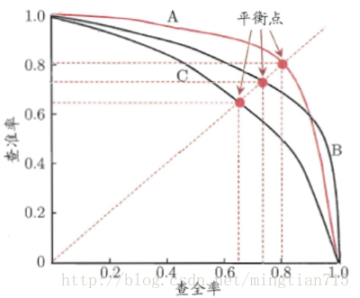

# PR曲线
&emsp;&emsp;P-R曲线的P就是查准率（Precision），R就是查全率（Recall）。以P作为横坐标，R作为纵坐标，就可以画出P-R曲线。

&emsp;&emsp;对于同一个模型，通过调整分类阈值，可以得到不同的P-R值，从而可以得到一条曲线（纵坐标为P，横坐标为R）。通常随着分类阈值从大到小变化（大于阈值认为P），Precision减小，Recall增加。比较两个分类器好坏时，显然是查得又准又全的比较好，也就是的PR曲线越往坐标（1，1）的位置靠近越好。若一个学习器的P-R曲线被另一个学习器完全”包住”，则后者的性能优于前者。当存在交叉时，可以计算曲线围住面积，不太容易判断，但是可以通过平衡点（查准率=查全率，Break-Even Point，BEP）来判断。

&emsp;&emsp;下图中，基于BEP的比较，可以认为模型A优于模型B。

	

