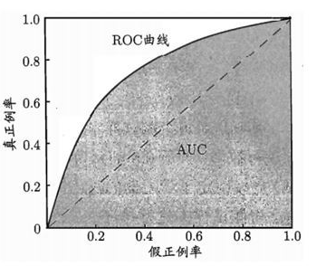

# ROC和AUC
&emsp;&emsp;根据混淆矩阵，我们可以得到另外两个指标：

- 真正例率(True Positive Rate)：TPR = TP/ (TP+FN)

- 假正例率(False Postive Rate)：FPR = FP/(TN+FP)

&emsp;&emsp;另外，真正率是正确预测到的正例数与实际正例数的比值，所以又称为灵敏度（敏感性，sensitive）；

&emsp;&emsp;对应于灵敏度有一个特异度（特效性，specificity）是正确预测到的负例数与实际负例数的比值（NPV = TN / (TN+FN)）。

&emsp;&emsp;我们以真正例率（TPR）作为纵轴，以假正例率（FPR）作为横轴作图，便得到了ROC曲线，而AUC则是ROC曲线下的面积。AUC的取值为[0.5-1]，0.5对应于对角线的“随机猜测模型”。

	

&emsp;&emsp;AUC值是一个概率值，当你随机挑选一个正样本以及负样本，当前的分类算法根据计算得到的Score值将这个正样本排在负样本前面的概率就是AUC值，AUC值越大，当前分类算法越有可能将正样本排在负样本前面，从而能够更好地分类。例如一个模型的AUC是0.7，其含义可以理解为：给定一个正样本和一个负样本，在70%的情况下，模型对正样本的打分（概率）高于对负样本的打分。

&emsp;&emsp;那么为什么要用AUC作为二分类模型的评价指标呢？为什么不直接通过计算准确率来对模型进行评价呢？

&emsp;&emsp;因为机器学习中的很多模型对于分类问题的预测结果大多是概率，即属于某个类别的概率，如果计算准确率的话，就要把概率转化为类别，这就需要设定一个阈值，概率大于某个阈值的属于一类，概率小于某个阈值的属于另一类，而阈值的设定直接影响了准确率的计算。也就是说AUC越高说明阈值分割所能达到的准确率越高。

# PR曲线与ROC曲线对比
&emsp;&emsp;与PR曲线相比，相对来讲ROC曲线会更稳定，在正负样本量都足够的情况下，ROC曲线足够反映模型的判断能力。而在正负样本分布得极不均匀(highly skewed datasets)的情况下（正样本极少），PRC比ROC能更有效地反映分类器对于整体分类情况的好坏。

&emsp;&emsp;总之，只画一个曲线时，如果没有data imbalance,倾向于用ROC（更简洁，更好理解）。如果数据样本不均衡,分两种情况：

- 情况1：如正样本远小于负样本，PRC更敏感，因为用到了precision=(TP/(TP+FP))。

- 情况2：正样本远大于负样本，PRC和ROC差别不大，都不敏感。

&emsp;&emsp;对于同一模型，PRC和ROC曲线都可以说明一定的问题，而且二者有一定的相关性，如果想评测模型效果，也可以把两条曲线都画出来综合评价。
