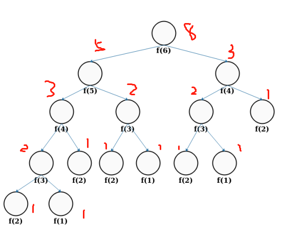
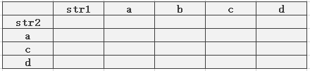
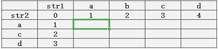
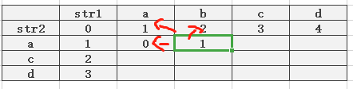
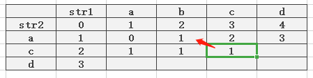
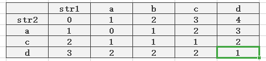

### 1.动态规划

#### 简介
在做文本相似度的时候遇到了动态规划这个概念。
这边做个简单的介绍，它原理概念和使用。

#### 基本思路：
如果需要解决一个算法问题，而这个算法问题是由几个小问题有规律的组成的。动态规划的思路是通过解决最小的问题，然后存储最小问题的解，然后在解答上一级问题的时候就可以直接使用这个解，因此可以轻松的解决这个算法问题，动态规划的核心是从低至上解决问题。

#### 问题举例：
斐波那契数列求解：
```java
f(n) = f(n - 1) + f(n - 2)
```
这个数列的求解我们早就学过了，可以用一个简单的递归就解决了，如下。
```java
public int f(int n)
{
    if(n<=0)
        return 0;
    if(n==1)
        return 1;
    return f(n-1)+f(n-2);
}
```
我们画出这个n = 6 的斐波那契数列计算过程的递归树形结构，大概是这样子的。最后答案是8.




动态规划的思想是从  f(1)  f(2) 开始。从底层一步一步往上计算，算法如下：
```java
public static int f(int n)
{
        if(n<=0)
            return n;
        int * p=new int[n+1];
        p[0]=0;
        p[1]=1;
        for(int i=2;i<=n;i++)
        {
            p[i]=p[i-1]+p[i-2];
        }       
        return p[n];
}
```

##### 最小编辑距离问题：
两个字符串之间存在差异，例如abcd 和 acd，或者happy 和 huppy ，如何通过最小的手段让两个字符一样。可以用的操作为，插入，删除和替换。

动态规划思路解决这个问题：两个字符串可以看出两个数组，str1 str2，从str1[0] 和str2[0] 开始比较，然后从一个方向引申，使用前面已有的数据进行分析。这样讲比	较抽象用一个图来表示会比较清楚。

假设两个数组分别是 abcd 和 acd，如下排布


##### 先初始化数组序列


>现在我们要开始做动态规划
先比较str1[0]  和 str2[0]  然后比较 str1[1] 和 str2[0] 就是横向比较，然后再跳到下一行横向比较，然后就是说，比较来干嘛，比较如果两个字符相等就取对角线的值，如果不相等就取周围三个最小的值加+1。比如我们现在要填的第一个值，  a == a   那么就填写对角线的 0。


这一次，a ！= b  了，查看周围三个地方，最小的值加+1


以此类推,  到第二列也是一样的。

填到这个值的时候，发现c == c 就填充对角线的。一直这样到最后

最后这个值就是我们需要的解。那么代码怎么写：如下

```java
/**
 * 动态规划算法
 * @param {string} a
 * @param {string} b
 * @returns {number} 从 a → b 的最小编辑距离
 */
function dynamicPlanning(a, b) {
    let lenA = a.length;
    let lenB = b.length;
    let d = [];
    d[0] = [];

    for (let j = 0; j <= lenB; j++) {
        d[0].push(j);
    }

    for (let i = 0; i <= lenA; i++) {
        if (d[i]) {
            d[i][0] = i;
        } else {
            d[i] = [];
            d[i][0] = i;
        }
    }

    for (let i = 1; i <= lenA; i++) {
        for (let j = 1; j <= lenB; j++) {
            if (a[i - 1] === b[j - 1]) {
                d[i][j] = d[i - 1][j - 1];
            } else {
                let m1 = d[i - 1][j] + 1;
                let m2 = d[i][j - 1] + 1;
                let m3 = d[i - 1][j - 1] + 1;
                d[i][j] = Math.min(m1, m2, m3);
            }
        }
    }

    return d[lenA][lenB];
}
```
