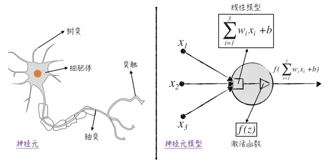

# 神经元与神经元模型
&emsp;&emsp;根据生物学的研究，人脑的计算单元是**神经元**（neuron）。它能根据环境变化做出反应，再将信息给其他的神经元。在人脑中，大约有860亿个神经元，它们相互联结构成了极其复杂的神经系统，而后者正是人类智慧的物质基础。因此遵循人脑的生物结构，我们首先需要搭建模型来模拟人的神经元。

如图1所示，一个典型的神经元由4个部分组成:
- **树突**：一个神经元有若干个树突，它们能接收来自其他神经元的信号，并将信号传递给细胞体。
- **细胞体**：细胞体是神经元的核心，它把各个树突传递过来的信号加总起来，得到一个总的刺激信号。
- **轴突**：当细胞体内的刺激信号超过一定阈值之后，神经元的轴突会对外发送信号。
- **突触**：该神经元发送的信号（若有）将由突触向其他神经元或人体内的其他组织（对神经信号做出反应的组织）传递。需要注意的是，神经元通常有多个突触，但它们传递的信号都是一样的。

	

图1

&emsp;&emsp;将上述的神经元结构抽象成数学概念，可以得到如图1所示的神经元模型。
- **模型输入**：模型的输入是数据里的自变量，比如图中的 $x_1$、$x_2$、$x_3$。它们用圆点表示，对应着神经元里的树突。
- **线性模型**：接收输入变量的是一个线性模型，在图中用正方形表示。这个线性模型对应着神经元的细胞体。值得注意的是，对于神经元中的线性模型，我们将模型中的权重项和截距项特意分开，用表示权重$w_i$，用$b$表示截距。
- **激活函数**：接下来是一个非线性的激活函数$f$（activation function），它将控制是否对外发送信号，在图中用三角形表示，对应这神经元里的轴突。在神经网络领域，常常用一个圆圈来概括地表示线性模型和激活函数，并不将两者分开。
- **模型输出**：将模型的各个部分联结起来得到最后的输出$f(\displaystyle \sum_i {{w_i}{x_i}+b})$，这个值将传递给下一个神经元模型，在图中用箭头表示，对应着神经元里的突触。值得注意的是，一个神经元可以有多个输出箭头，但它们所输出的值都是一样的。

&emsp;&emsp;在神经元模型中，非线性的激活函数是整个模型的核心。在最初的神经元模型中，它的定义是非常直观的，当函数的自变量大于某个阈值时，则等于1，否则等于0。具体的公式如下：

$${\displaystyle f={\begin{cases}{1},&x>0 \\\ {0},&{x \leq  0}  \end{cases}}}$$

&emsp;&emsp;这个模型在学术上被称为**感知器**（perceptron），它可被用来解决二元分类问题（因为模型的输出是0或1）。感知器虽然在某种程度上模拟了神经元里轴突的行为，但处理方式有些太过粗糙了，因为在生物学上，神经元输出的是一个连续值而非离散值。这导致感知器的模型效果很一般。为了改进这一点，通常使用**sigmoid函数**（sigmoid function，也称为S函数）来作为神经元的激活函数，这样的模型被称为**sigmoid神经元**（sigmoid neuron）。

引用：\
[1]https://www.jianshu.com/p/f5d8f22a9504
