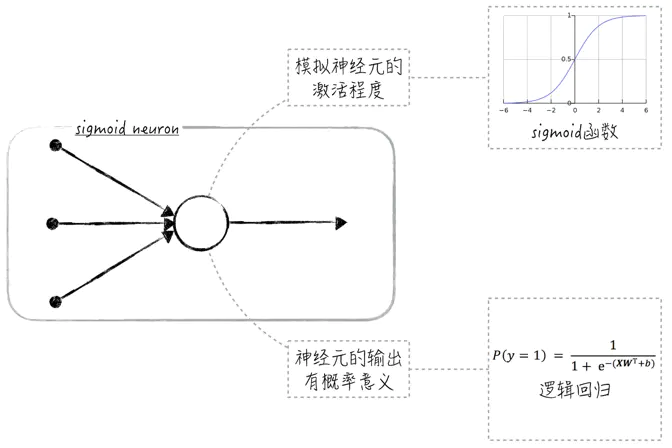

# Sigmoid与二元逻辑回归
&emsp;&emsp;Sigmoid函数在数据科学领域是一个非常重要的函数。特别是在神经网络和深度学习领域，我们会经常见到它。sigmoid的函数图像呈S形状，因此也常被称为S函数，具体的公式如下：
$$S(z)={\frac 1 {1+e^{-z}}}$$

&emsp;&emsp;使用sigmoid函数作为神经元里的激活函数有两大好处。从实用的角度来讲，sigmoid函数能将任意的实数值映射到 $(0,1)$，当公式中的变量 $z$ 是很大的负数时，函数值接近0；当变量 $z$ 是很大的正数时，函数值接近1。这个特性在神经元上也能找到很好的解释：函数值接近0表示神经元没被激活，而函数值接近1表示神经元完全被激活。

&emsp;&emsp;从理论的角度来讲，sigmoid函数模拟了两种效应的相互竞争：假设正效应和负效应都和自变量 $X = (x_1, x_2, ..., x_k)$ 是近似线性关系。具体的公式如下，其中，$Y^*$ 表示正效应，$Y^{\sim}$ 表示负效应，$W_i = (w_{i, 1}, w_{i, 2}, ..., w_{i, k})$ 和 $b_i$ 是模型参数，$\theta$ 和 $\tau$ 是服从正态分布的随机干扰项。

$$Y^*=XW_1^T+b_1+\theta$$
$$Y^{\sim}=XW_2^T+b_2+\tau$$

&emsp;&emsp;数学上可以证明，正效应大于负效应的概率可由一个sigmoid函数来近似，如公式所示:
$$P(Y^*-Y^{\sim})=S(XW^T+b)$$

&emsp;&emsp;因此在神经元模型里使用sigmoid函数，就相当于给神经元的输出赋予了概率意义，这使得模型的理论基础更加扎实，也使得模型能被用于解决二元分类问题，比如当sigmoid神经元的输出大于0.5时，则预测类别为1，否则预测类别为0。值得注意的是，在这种情况下，sigmoid神经元其实就是二元逻辑回归模型，如下图所示：

	

sigmoid神经元

