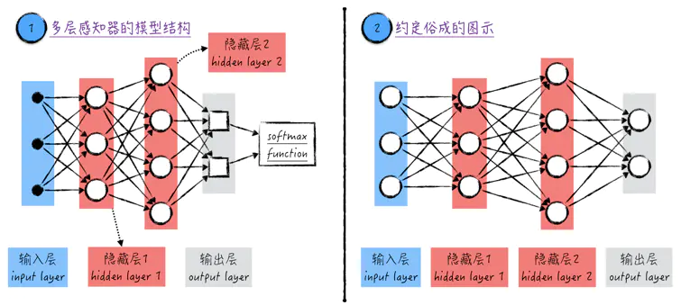

# 神经元到神经网络
&emsp;&emsp;在人体中，单个神经元能做的事情非常有限，但多个神经元相互交织在一起就组成了人类强大的神经系统。这启发我们需要将多个神经元模型联结起来组成复杂的神经网络。

# 神经网络模型
&emsp;&emsp;将多个神经元联结起来最简单且最直观的方法就是将它们首尾相接形成一个没有环的网络（acyclic graph），在这个网络中，一个神经元的输出是另一个神经元的输入。这种类型的神经网络在学术上被称为人工神经网络（Artificial Neural Networks，ANN），它的模型拓扑结构如图所示：

	

图1

&emsp;&emsp;在神经网络中，神经元是按**层**（layer）组织的。每一层包含若干个神经元，层内部的神经元是相互独立的，也就是说它们之间并不相连；但相邻的两层之间是全连接的（fully-connected），也就是说任意两个神经元都是直接相连的（当然前提是这两个神经元分别来自相邻的两层）。

&emsp;&emsp;神经网络中不同的层按功能分为3类，分别是**输入层**（input layer）、**隐藏层**（hidden layer）以及**输出层**（output layer）。

- 输入层：神经网络里只有一个输入层，其中的元素在图中标记1里用黑色的点表示：一个黑点表示一个模型的输入，也就是训练数据里的一个自变量，若训练数据有个特征，则输入层里一定有相应的个点。在模型中，输入层对数据不做任何处理，只负责将信息传递给后面的隐藏层（若网络里没有隐藏层，则将信息直接传递给输出层，这时候，神经网络其实就是逻辑回归）。

- 隐藏层：神经网络可以有多个隐藏层，比如图1中就有两个隐藏层。隐藏层里的元素就是之前讨论的神经元模型（更具体一点，它们都是sigmoid神经元），因此在图中标记1里用圆圈表示。值得注意的是，一个圆圈包含了线性模型以及激活函数。在多层感知器里，隐藏层的作用是传输并分析数据。

- 输出层：神经网络里只有一个输出层。输出层里的元素与隐藏层里的不同，它只包含线性模型，因此在图中标记1里用方块表示。虽然输出层的名字里有“输出”二字，但它并不是模型的最终输出，与逻辑回归类似，输出层的结果经过softmax函数处理后，才能得到最终的模型结果（如果该神经网络解决的是分类问题）。

&emsp;&emsp;正如上面讨论的，不同层里的元素是不一样的，但对于神经网络领域，大家约定俗成地都用圆圈来表示它们，也将它们统称为神经元（虽然这样很容易给初学者造成误解），并将最后一步的softmax函数省略掉，如图1中标记2所示。

&emsp;&emsp;图1中的标记1和标记2表示的同样的神经网络，其中标记2中的图示在神经网络领域是通用的，因此在之后的章节中我们将沿用这样的记号。

&emsp;&emsp;对于神经网络，通常会以它所拥有的层数来命名，但这时输入层是不计算在内的，比如图1中的模型被称为3-层神经网络（3-layer neural networks）。当然这样的命名并不能唯一地标识一个神经网络，比如将图1中的隐藏层1增加到10个神经元，得到的仍然是一个3-层神经网络。

> 注意：搭建神经网络时可以有多输入、多输出的情况。

引用：\
[1] https://www.jianshu.com/p/f6e9c29310cc
