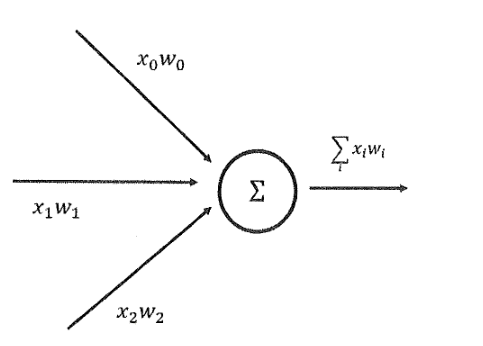
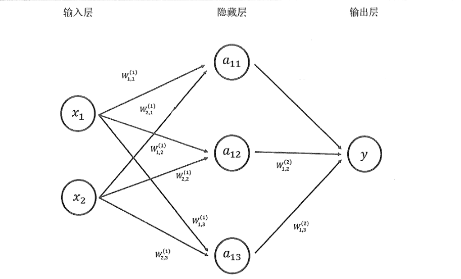
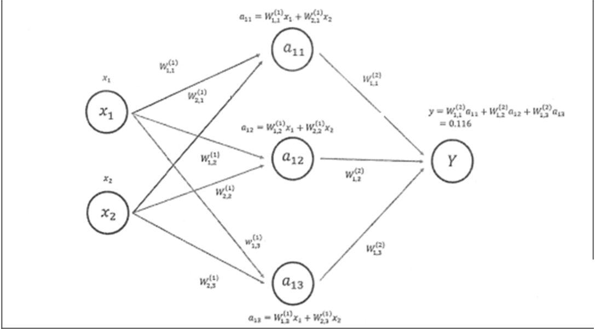

# 前向传播算法
&emsp;&emsp;正向传播算法，也叫前向传播算法，顾名思义，是由前往后进行的一个算法。

&emsp;&emsp;一个神经元有多个输入和一个输出，每个神经元的输入既可以是其他神经元的输出也可以是整个神经网络的输入。所谓神经网络的结构就是指的是不同的神经元之间的连接结构。

&emsp;&emsp;如下图所示，一个最简单的神经元结构的输出就是所有输入的加权和，而不同的输入的权重就是神经元的参数。神经网络的优化过程就是优化神经元中参数的取值的过程。

	

图1 神经元

 

&emsp;&emsp;不同的神经网络结构前向传播的方式也不一样，本节介绍最简单的全连接神经网络结构的前向传播算法。之所以称之为全链接神经网络是因为相邻两层之间任意两个节点都有连接，如下图所示：

	

图2 神经网络

 

&emsp;&emsp;计算神经网络的前向传播结果需要三部分信息：
- 第一个部分是神经网络的输入，这个输入就是从实体中提取的特征向量。比如在上图中有两个输入 $x_1$ 和 $x_2$ 。
- 第二个部分为神经网络的连接结构。神经网络是由神经元构成的，神经网络的结构给出不同神经元之间输入输出的连接关系。神经网络中的神经元也可以称之为节点，通常我们使用节点来指代神经网络中的神经元。 在上图中，节点有两个输入，他们分别是 $x_1$ 和 $x_2$ 的输出。而的输出则是节点 $y$ 的输入。
- 最后一个部分是每个神经元中的参数。在上图中用W来表示神经元中的参数。$w$ 的上标表明了神经网络的层数，比如 $w^{(1)}$ 表示第一层节点的参数，而 $w^{(2)}$ 表示第二层节点的参数。W的下标表明了连接节点编号， 比如 $w_{1,2}^{(1)}$ 表示连接 $x_1$ 和 $a_12$ 节点的边上的权重。如何优化每一条边的权重将是算法的关键，这一节假设这些权重是已知的。给定神经网络的输入，神经网络的结构以及边上权重，就可以通过前向传播算法来计算出神经网络的输出。下图展示了这个神经网络前向传播的过程。

	

图2 神经网络计算

 

&emsp;&emsp;通过上面的描述可知前向传播算法与全连接神经网络非常相似
