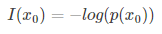
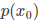
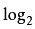
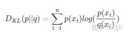
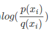
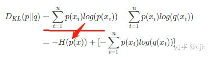

#交叉熵的简单理解
## 1.交叉熵

要懂得交叉熵，先要懂得信息量

### 1.1信息量的定义

香农（C. E. Shannon）信息论应用概率来描述不确定性。信息是用不确定性的量度定义的.一个消息的可能性愈小，其信息愈多；而消息的可能性愈大，则其信息愈少.事件出现的概率小，不确定性越多，信息量就大，反之则少。

<div align=center>
	
</div>
<div align=center><font color="gray">图 1</font></div>
<br>

其中
<div align=center>
	
</div>
<div align=center><font color="gray">图 2</font></div>
<br>

标识x0 事件出现的概率。

通俗的讲，信息量，就是某个事件能给你带来多大的震撼，越震撼信息量就越大。我们来举个例子

抛硬币是人们经常用来举例的，假设

x1 表示硬币正面 x2表示硬币反面，另外x3表示硬币竖起来。（x3事件我们现在只是用来举例不必深究）

则这个三者的概率(p)

```
p(x1) 0.49995

p(x2) 0.49995

p(x3） 0.0001
```


则这个三个事件能带给我们的信息量（I）是多少呢？

```
I(x1) = -log(0.49995) = 1.000144277

I(x2) = -log(0.49995) = 1.000144277

I(x3) = -log(0.0001) = 13.28771238
```

这边的log是
<div align=center>
	
</div>
<div align=center><font color="gray">图 3</font></div>
<br>
所以你抛一枚硬币，如果它立起来了，你会说卧槽---表示信息量很大。 实际上x3 的概率还会更小，我这边只是为了举例子。


### 1.2熵的定义

<div align=center>
	
</div>
<div align=center><font color="gray">图 4</font></div>
<br>
n表示几个可能的概率事件。

这个熵，怎么理解能，我们如果不求和，单个的看就是概率和信息量的乘积。把所有的事件的这个乘积加起来就是熵。

定义是这样定义的，但是怎么理解，就看个人的理解了。

我们计算下上面抛硬币的熵：

0.49995*1.000144277 + 0.49995*1.000144277 + 0.0001*13.28771238 = 1.001373034

###1.3 相对熵的定义

再提出相对熵之前我们先讲一个出老千的例子：比如还是上述抛硬币，我和另外一个同学A再用这个抛硬币来赌博，如果正面朝上我赢，如果反面朝上同学A赢，如果立起来谁也不算赢。但是啊，上面我们算过了p(x1) 的概率 是0.49995 ，但是有一天，同学A出老千，使用磁铁等不正规手段，把p(x1) 正面的概率降低到了0.33333以下，我们记q(x1) = 0.33333 导致我输了很多钱。

那么，这边x1 正面朝上的概率，相对两个场景就有了两个不同的概率分布。我们如何去描述这两个场景信息差异。就是用相对熵。
<div align=center>
	
</div>
<div align=center><font color="gray">图 5</font></div>
<br>


我们看相对熵D，如果p 场景下的概率和q场景下的概率都是一样的，意思是q场景下我的同学没有出老千，那么p和q的比例就是1。那么
<div align=center>
	
</div>
<div align=center><font color="gray">图 6</font></div>
<br>

就等于0，那么相对熵就是为零。就是表示这两个场景的信息没有差异。

将D进行变换一下，
<div align=center>
	
</div>
<div align=center><font color="gray">图 7</font></div>
<br>

那么好了，由于p场景下x事件是恒定已知的，因为没有人做手脚。所有H函数是确定的，不确定的就是后面的部分。


我们定义H（p,q）叫做交叉熵。

## 2.loss函数在Tensorflow中的定义

```python
loss = tf.reduce_mean(tf.square(y - y_))
cross = -tf.reduce_sum(y_ * tf.log(y + 1e-10))
```

在Tensorflow中常常有，以上两种定义loss函数。

第一个是均方差第二个就是交叉熵。


为什么使用交叉熵，理论上我没有去证明，大概想一想。

在梯度求极限的情况下，使用均方差是比较好的

但是如果是信息分类，大多反应的是各种场景的信息量，所有估计交叉熵会好。实践表明就是如此。


学的比较浅，有错误的地方欢迎批评指正。
