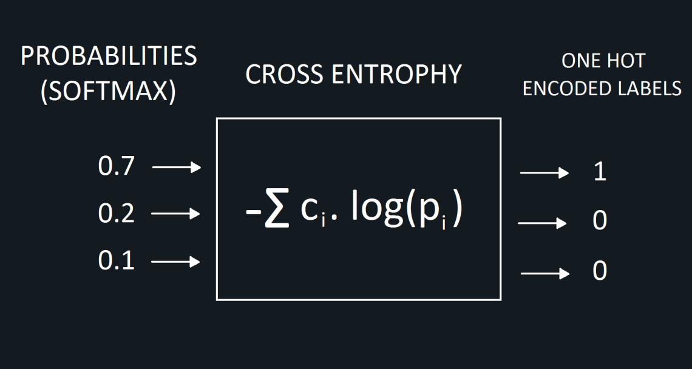
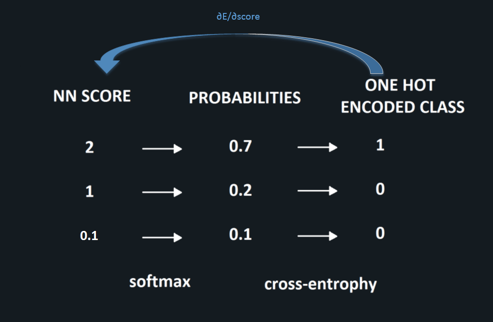
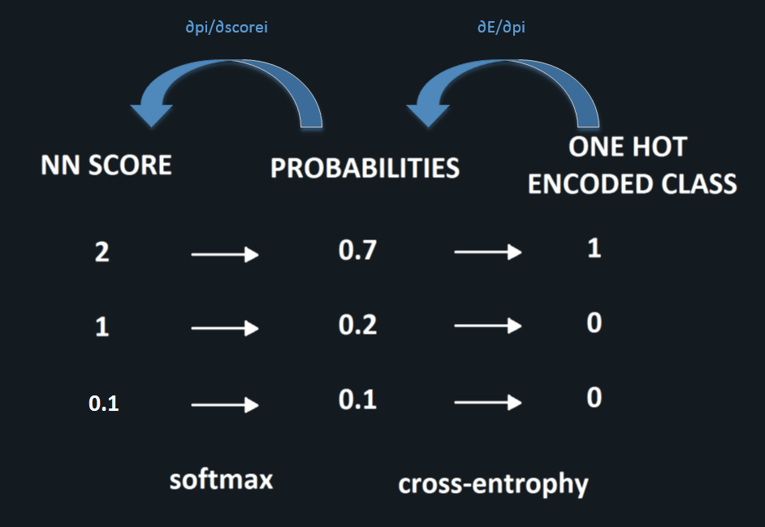
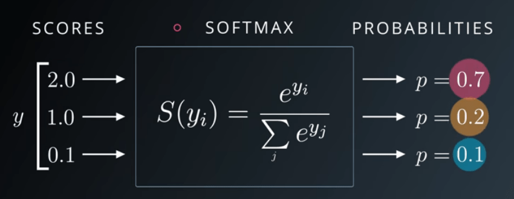

# 交叉熵损失函数
&emsp;&emsp;神经网络在多类分类问题中产生多个输出。然而，它们没有能力产生精确的输出，只能产生连续的结果。我们将应用一些附加步骤将连续结果转换为精确的分类结果。

&emsp;&emsp;应用softmax函数将输出归一到 $[0,1]$ 范围内。此外，当使用softmax时，输出的和等于1。然后，应用one-hot编码将softmax输出转换成二进制形式的输出。这就是为什么，softmax和one-hot编码将分别应用于神经网络输出层。最后，真正有标签的输出将是预测的分类输出。在此，交叉熵函数建立了概率和用one-hot编码的标签之间的联系。

	

概率到one-hot编码

 

## 交叉熵损失函数
&emsp;&emsp;我们需要知道损失函数的导数才能反向传播。如果损失函数为MSE，则其导数很容易（预期和预测的输出）。当损失函数为交叉熵时，情况变得更加复杂。

&emsp;&emsp;多分类交叉熵损失：
$$ E=-\sum_{i=0}^N c_i \cdot log(p_i) $$

&emsp;&emsp;二分类交叉熵函数：
$$ E=-\sum_{i=1}^n [c_i \cdot log(p_i) + (1-c_i) \cdot log(1-p_i)] $$

其中 $c_i$ 是one-hot编码（或标签），而 $p$ 是指softmax应用概率。在上面的方程式中，对数的底是e。

## 反向传播梯度计算
&emsp;&emsp;首先softmax将神经网络的得分转换成每个类别的概率，接下来交叉熵将softmax计算出的概率转换为one-hot编码。这就是为什么，我们计算总误差需要计算每个得分的导数。

	

反向误差计算

 

计算每个得分的导数可以使用偏导 $\displaystyle \frac {\partial E} {\partial score_i}$，同时使用链式法则，如下图：

	

链式法则

 

因此有：
$$\displaystyle \frac {\partial E} {\partial score_i}=\displaystyle \frac {\partial E} {\partial p_i} \cdot \displaystyle \frac {\partial p_i} {\partial score_i}$$

### 补充阅读：二分类交叉熵梯度计算
**第一步： $\displaystyle \frac {\partial E} {\partial p_i}$ 计算**

首先计算 $\displaystyle \frac {\partial E} {\partial p_i}$ ,其中 $E$ 展开：

$$E= {\displaystyle -\sum_{i=1}^n [c_i \cdot log(p_i) + (1-c_i) \cdot log(1-p_i)])} \\\ =-(c_1 \cdot log(p_1) + (1-c_1) \cdot log(1-p_1)) \\\ -(c_2 \cdot log(p_2) + (1-c_2) \cdot log(1-p_2)) \\\ - \ldots \\\ -(c_i \cdot log(p_i) + (1-c_i) \cdot log(1-p_i)) \\\ - \ldots \\\ -(c_n \cdot log(p_n) + (1-c_n) \cdot log(1-p_n))$$

求偏导数：
$$\displaystyle \frac {\partial E} {\partial p_i} = \frac {\partial (\displaystyle -\sum_{i=1}^n [c_i \cdot log(p_i) + (1-c_i) \cdot log(1-p_i)])} {\partial p_i} \\\ = -\frac { \displaystyle \partial {(c_i \cdot log(p_i) + (1-c_i))} \cdot log(1-p_i)} {\partial p_i} \\\ =
- \frac { \displaystyle \partial {(c_i \cdot log(p_i))}} {\partial p_i} - \frac { \displaystyle \partial {((1-c_i) \cdot log(1-p_i))}} {\partial p_i}$$

由于 $\displaystyle ln(x)$ 的导数为 $\displaystyle \frac 1 x$，进一步简化：
$$- \frac { \displaystyle \partial {(c_i \cdot log(p_i))}} {\partial p_i} - \frac { \displaystyle \partial {((1-c_i) \cdot log(1-p_i))}} {\partial p_i} =- {\frac {c_i} {p_i} -{\frac {1-c_i} {1-p_i}} \cdot {\frac {\partial {(1-p_i)}} {\partial p_i}}} \\\ = - {\frac {c_i} {p_i} -{\frac {1-c_i} {1-p_i}} \cdot (-1)} \\\ = - {\frac {c_i} {p_i} + {\frac {1-c_i} {1-p_i}}}$$

因此：
$$ \displaystyle \frac {\partial E} {\partial p_i} =  - {\frac {c_i} {p_i} + {\frac {1-c_i} {1-p_i}}} $$

**第二步： $\displaystyle \frac {\partial p_i} {\partial score_i}$ 计算**

	

Softmax函数

 

$$\displaystyle \frac {\partial p_i} {\partial score_i}=p_i \cdot (1-p_i)$$

softmax梯度计算参考：[这里](https://sefiks.com/2017/11/08/softmax-as-a-neural-networks-activation-function/)

**第三步： $\displaystyle \frac {\partial E} {\partial score_i}$ 计算**
$$\begin{aligned} \displaystyle \frac {\partial E} {\partial score_i}  &= \displaystyle \frac {\partial E} {\partial p_i} \cdot \displaystyle \frac {\partial p_i} {\partial score_i} \\\ &=(- {\frac {c_i} {p_i} + {\frac {1-c_i} {1-p_i}}}) \cdot p_i \cdot (1-p_i) \\\ &= p_i – c_i \end{aligned}$$

引用：\
[1] https://sefiks.com/2017/12/17/a-gentle-introduction-to-cross-entropy-loss-function/
