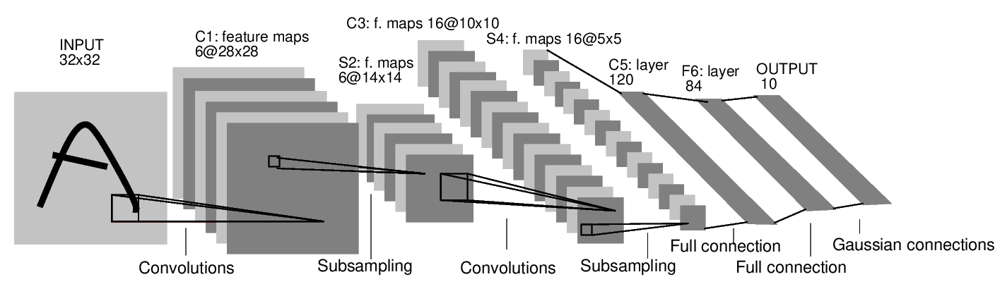

# 1. 论文信息
论文：Gradient-based learning applied to document recognition. Proceedings of the IEEE, november 1998.

作者：Y. LeCun, L. Bottou, Y. Bengio, and P. Haffner.

下载地址：http://yann.lecun.com/exdb/publis/psgz/lecun-98.ps.gz

来源：http://yann.lecun.com/exdb/lenet/

# 2. 发展历史
&emsp;&emsp;LeNet5诞生于1994年，是最早的卷积神经网络之一，并且推动了深度学习领域的发展。自从1988年开始，在多年的研究和许多次成功的迭代后，这项由Yann LeCun完成的开拓性成果被命名为LeNet5。

&emsp;&emsp;1989年，Yann LeCun等人在贝尔实验室的研究首次将反向传播算法进行了实际应用，并且认为学习网络泛化的能力可以通过提供来自任务域的约束来大大增强。他将使用反向传播算法训练的卷积神经网络结合到读取“手写”数字上，并成功应用于识别美国邮政服务提供的手写邮政编码数字。这即是后来被称为LeNet的卷积神经网络的雏形。同年，Yann LeCun在发表的另一篇论文中描述了一个小的手写数字识别问题，并且表明即使该问题是线性可分的，单层网络也表现出较差的泛化能力。而当在多层的、有约束的网络上使用有位移不变性的特征检测器（shift invariant feature detectors）时，该模型可以在此任务上表现得非常好。他认为这些结果证明了将神经网络中的自由参数数量最小化可以增强神经网络的泛化能力。

&emsp;&emsp;1990年他们发表的论文再次描述了反向传播网络在手写数字识别中的应用，他们仅对数据进行了最小限度的预处理，而模型则是针对这项任务精心设计的，并且对其进行了高度约束。输入数据由图像组成，每张图像上包含一个数字，在美国邮政服务提供的邮政编码数字数据上的测试结果显示该模型的错误率仅有1%，拒绝率约为9%。

&emsp;&emsp;其后8年他们的研究一直继续，直到1998年，Yann LeCun，Leon Bottou，Yoshua Bengio和Patrick Haffner在发表的论文中回顾了应用于手写字符识别的各种方法，并用标准手写数字识别基准任务对这些模型进行了比较，结果显示卷积神经网络的表现超过了其他所有模型。他们同时还提供了许多神经网络实际应用的例子，如两种用于在线识别手写字符的系统和能每天读取数百万张支票的模型。

&emsp;&emsp;他们的研究取得了巨大的成功，并且激起了大量学者对神经网络的研究的兴趣。在今天向过去回首，目前性能最好的神经网络的架构已与LeNet不尽相同，但这个网络是大量神经网络架构的起点，并且也给这个领域带来了许多灵感。

# 3. 模型结构分析
## 3.1. 模型结构图


## 3.2. 模型层说明
* **第一层，卷积层（C1）**

&emsp;&emsp;这一层的输入就是原始的图像像素，LeNet-5模型接受的输入层大小为32x32x1。第一个卷积层过滤器的尺寸为5x5，深度为6不使用全0填充，步长为1。因为没有使用全0填充，所以这一层的输出的尺寸为32-5+1=28，深度为6。这一个卷积层总共有5x5x1x6+6=156个参数，其中6个为偏置项参数。因为下一层的节点矩阵有28x28x6=4704个节点，每个节点和5x5=25个当前层节点相连，所以本层卷积层总共有4704x(25+1)=122304个连接 。

* **第二层，池化层（S2）**

&emsp;&emsp;这一层的输入为第一层的输出，是一个28x28x6的节点矩阵。本层采用的过滤器大小为2x2，长和宽的步长均为2，所以本层的输出矩阵大小为14x14x6。

* **第三层，卷积层（C3）**

&emsp;&emsp;本层的输入矩阵大小为14x14x6，使用的过滤器大小为5x5，深度为16。本层不使用全0填充，步长为1。本层的输出矩阵大小为 10x10x16。按照标准的卷积层 ，本层应该有5x5x6x16+16=2416个参数，10x10x16(25+1)=41600个连接 。

* **第四层，池化层（S4）**

&emsp;&emsp;本层的输入矩阵大小为10x10x16，采用的过滤器大小为2×2，步长为2。本层的输出矩阵大小为5x5x16。

* **第五层，卷积层（C5）**

&emsp;&emsp;本层的输入矩阵大小为5x5x16，使用的过滤器的大小为5×5，深度为120,。本层不使用全0填充，步长为1。本层的输出矩阵大小为1x1x120。总共有5x5x16x120+120=48120个参数。

* **第六层，全连接层（F6）**

&emsp;&emsp;本层的输入节点个数为120个，输出节点个数为84个，总共参数为120x84+84=10164个。

* **第七层，全连接层（Output）**

&emsp;&emsp;本层的输入节点个数为84个，输出节点个数为10 个，分别代表数字0到9，总共参数为84x10+10=850个。LeNet-5模型论文中最后一层输出层的结构和全连接层有区别，但我们这用全连接层近似的表示 。

# 3.2. Keras实现
```python
# 定义模型
def create_model():
    model = models.Sequential()
    model.add(layers.Conv2D(6, (5, 5), input_shape=(32, 32, 1)))
    model.add(layers.MaxPooling2D((2, 2)))
    model.add(layers.Conv2D(16, (5, 5)))
    model.add(layers.MaxPooling2D((2, 2)))
    model.add(layers.Conv2D(120, (5, 5)))
    model.add(layers.Dense(84))
    model.add(layers.Dense(10, activation='softmax'))
    return model

# 创建模型
model = create_model()
# 输出模型结构
model.summary(line_length=80)
```

输出结构：
```
________________________________________________________________________________
Layer (type)                        Output Shape                    Param #
================================================================================
conv2d_1 (Conv2D)                   (None, 28, 28, 6)               156
________________________________________________________________________________
max_pooling2d_1 (MaxPooling2D)      (None, 14, 14, 6)               0
________________________________________________________________________________
conv2d_2 (Conv2D)                   (None, 10, 10, 16)              2416
________________________________________________________________________________
max_pooling2d_2 (MaxPooling2D)      (None, 5, 5, 16)                0
________________________________________________________________________________
conv2d_3 (Conv2D)                   (None, 1, 1, 120)               48120
________________________________________________________________________________
dense_1 (Dense)                     (None, 1, 1, 84)                10164
________________________________________________________________________________
dense_2 (Dense)                     (None, 1, 1, 10)                850
================================================================================
Total params: 61,706
Trainable params: 61,706
Non-trainable params: 0
```

# 4. 发展分析
## 4.1. 瓶颈
&emsp;&emsp;LeNet的设计较为简单，因此其处理复杂数据的能力有限；此外，在近年来的研究中许多学者已经发现全连接层的计算代价过大，而使用全部由卷积层组成的神经网络。
## 4.2. 未来发展方向
&emsp;&emsp;现在在研究中已经很少将LeNet使用在实际应用上，对卷积神经网络的设计往往在某个或多个方向上进行优化，如包含更少的参数（以减轻计算代价）、更快的训练速度、更少的训练数据要求等。

参考：\
[1] https://www.jiqizhixin.com/graph/technologies/6c9baf12-1a32-4c53-8217-8c9f69bd011b \
[2] https://blog.csdn.net/Sophia_11/article/details/84720882
