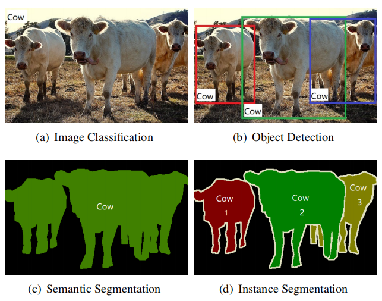
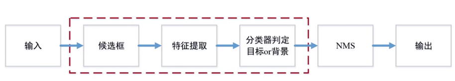
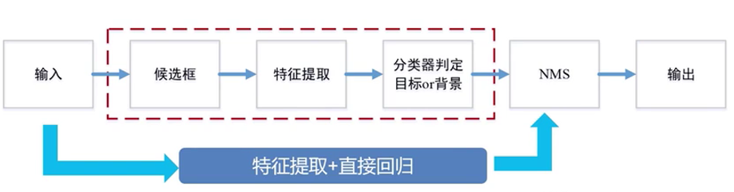
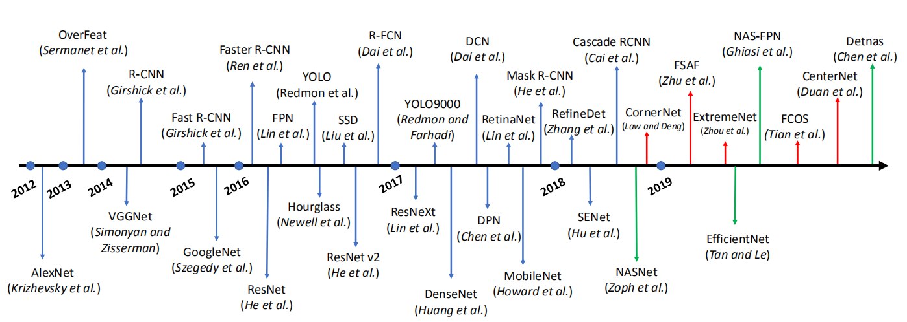
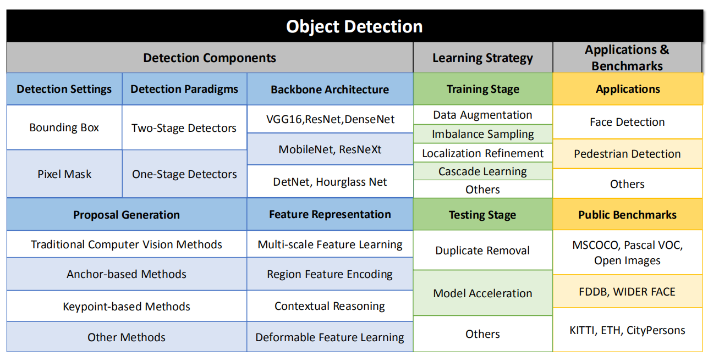

# 1. 目标检测技术概述

> 本系列内容基本来自目标检测综述论文《Recent Advances in Deep Learning for Object Detection》

> 下载地址：https://arxiv.org/pdf/1908.03673.pdf

## 1.1. 视觉任务定义
&emsp;&emsp;在计算机视觉领域，有几个基本的视觉识别问题：
- 图像分类(image classification)
- 物体检测(object detection)
- 实例分割(instance segmentation)
- 语义分割(semantic segmentation)

其中：
- 图像分类用于识别给定的图像;
- 目标检测用于识别每个目标类别，并且需要通过边界框预测每个目标的位置;
- 语义分割用于识别每个像素的所属类别，与目标检测相比，语义分割并不区分同一类别的像素;
- 实例分割用于识别不同的对象，并为每个对象分配一个单独的分类像素级掩码。它是目标检测和语义分割相结合的方法。事实上，实例分割可以看作是目标检测的一种特殊情况，它不需要定位对象的边界框，而是需要像素级的定位。

	

图1 视觉任务

 

&emsp;&emsp;一个好的目标检测算法应该对图像的空间信息有很强的语义理解能力。目标检测是许多计算机视觉应用的基本步骤，例如人脸识别，行人检测、视频分析等。

## 1.2. 传统目标检测流程以及存在问题
&emsp;&emsp;在早期，在深度学习时代之前目标检测分为三个步骤：
1. **区域提名**

    区域提名的作用是搜索并给出图像中可能包含对象的位置，这些位置也被称为感兴趣区域（ROI）；一个直观的想法是用滑动窗口扫描整个图像。为了获取目标的信息，输入图像的缩放到不同尺度，滑动窗口同时按不同比例调整大小，用于在这些图像中滑动。

2. **特征提取**

    从滑动窗口对应的区域图像中得到一个固定长度的特征向量，这个特征向量通常由低级视觉描述符编码，如作为SIFT（尺度不变特征变换），Haar，HOG（梯度直方图）或SURF（加速稳健特征），显示了一定的规模稳健性，照明和旋转变化。

3. **区域分类**

    区域分类器对特征向量进行标签分类。由于支持向量机（SVM）在小规模训练数据上具有良好的性能，所以通常在这里使用。此外，一些分类技术，如bagging，cascade learning在区域分类步骤中使用了adaboost，进一步提高了检测精度。

如下图传统目标检测方法基本流程：

	

图 传统目标检测方法基本流程

 

&emsp;&emsp;大多数成功的传统目标检测方法都集中在精心设计特征描述子以获取感兴趣区域的特征向量。借助于良好的特征表示和健壮的区域分类器，在Pascal VOC数据集上取得了令人印象深刻的结果。值得注意的是，DPM目标检测算法分别于2007年、2008年和2009年3次获取VOC挑战赛冠军。然而，在2008年至2012年期间基于这些传统方法的Pascal-VOC研究进展逐渐增加，但并没有带来很大的提升，这说明了传统目标检测方法的局限性。主要有以下问题：
- 在区域提名过程中，有许多区域是冗余的，这导致分类过程中出现大量假阳性样本。
- 滑动窗口的尺度是手动设计的，不能很好地匹配目标；
- 特征描述符是手工构建的低级视觉特征，这使得在复杂的上下文中很难捕捉到有代表性的语义信息;
- 基于pipline的设计无法获得全局最优解。

## 1.3. 基于深度学习的目标检测技术
&emsp;&emsp;在深度卷积神经网络（DCNN）成功应用于图像分类之后，目标检测在深度学习技术的基础上也取得了显著的进步。基于深度学习的算法在性能上大大优于传统的检测算法。深卷积神经网络是一种受生物启发的用于计算层次特征的结构。一个早期尝试建立这样的层次和空间不变量图像分类的模型是Fukushima提出的“neocognitron”(神经认知机)。然而，这种早期尝试缺乏有效的监督学习优化技术。基于在这种模式下，Lecun等人通过反向传播随机梯度下降（SGD）优化卷积神经网络，并在数字识别取得很大的进展。然而，在那之后，深卷积神经网络并没有被深入研究，支持向量机变得更加突出。这是因为深度学习一些局限性：

* 缺乏大规模标注的训练数据，导致过拟合的；
* 有限的计算资源；
* 与支持向量机相比，理论支持较弱。

&emsp;&emsp;2009年，李飞飞等人收集了一个大规模带注释的图像数据集，包含1.2M高分辨率图像的ImageNet，使大规模训练深层模型成为可能。随着并行计算资源的发展计算系统（如GPU集群），2012年Hinton等人利用ImageNet数据集训练了一个大型深度卷积模型AlexNet，在Large Scale Visual Recognition Challenge（ILSVRC）上很大程度超越了其它方法，并获得了冠军。在成功应用DCNN进行图像分类之后，深度学习技术很快就应用到了其他视觉任务。

&emsp;&emsp;与传统检测器中使用的手工描述子不同，深度卷积神经网络从原始像素到高层语义信息生成**层次化特征表示**，并从训练数据中自动学习，表现出在复杂的环境中更强的判别能力。此外，得益于强大的学习能力，深层卷积神经网络可以用更大的数据集获得更好的特征表示，而传统视觉描述子的学习能力已被限制，当有更多数据可用时也无法改进。这些特性使得设计基于深卷积神经网络的目标检测算法成为可能，并且可以以端到端的方式进行优化，具有更强大的特征表示功能。

&emsp;&emsp;基于深度学习的目标检测基本流程如下图：

	

图 基于深度学习的目标检测方法基本流程（红色虚框为传统方式）

 

&emsp;&emsp;目前，基于深度学习的目标检测框架主要可分为两类：
- 两阶段(**Two-Stage**)检测方法，如R-CNN及其变体
- 一阶段(**One-Stage**)检测方法，如YOLO、SSD和其变体。

&emsp;&emsp;Two-Stage方法首先使用区域提名机制生成候选区域并提取特征，然后是区域分类器预测候选区域的类别。One-Stage方法直接在特征图的每个位置对目标进行分类预测，无需级联区域分类步骤。Two-Stage方法通常可以获得更好的检测性能，常用来刷新基准测试，而One-Stage明显更时间效率高，适用于实时目标检测。图2说明了2012年之后主要的发展和基于深度学习的目标检测技术的里程碑。

	

图2 2012年以来基于深卷积神经网络的目标检测研究的主要里程碑。基于Anchor-free（红色）和AutoML（绿色）技术的检测器是未来两个重要的研究方向。

 

## 1.4. 后续介绍
&emsp;&emsp;本系列的目的是全面了解基于深度学习的目标检测算法。图3显示了关键方法的分类，分别为**检测组件**、**学习策略**、**应用** 和 **基准**。

	

图3 关键技术分类

 

&emsp;&emsp;对于检测组件，我们首先介绍两种检测设置：边界框级别（bbox级别）以及像素掩码级（掩码级）定位。Bbox级别的算法需要通过矩形边框来定位对象，而需要更精确的像素级掩模来分割掩码级算法中的对象。

&emsp;&emsp;接下来，我们总结了两个代表性框架：两阶段检测和一阶段检测。然后我们做一个详细的调查每个检测组件，包括主干架构，区域提名和特征学习。

&emsp;&emsp;对于学习策略，我们首先强调学习策略的重要性是由于检测器训练难度大，然后详细介绍了训练和测试两个阶段的优化技术。

&emsp;&emsp;最后，我们回顾了一些真实的对象基于检测的应用包括人脸检测、行人检测、标志检测和视频分析。

&emsp;&emsp;我们还讨论了公开可用和常用的基准以及这些检测任务的评估指标。

&emsp;&emsp;最后我们展示近年来在公共基准上进行通用检测的最新结果。
