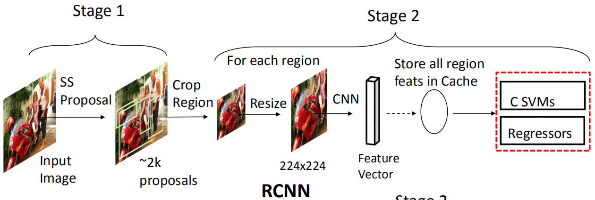
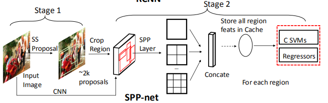
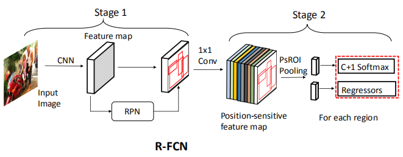
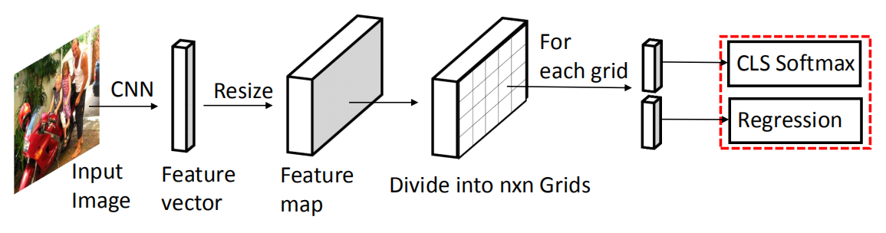
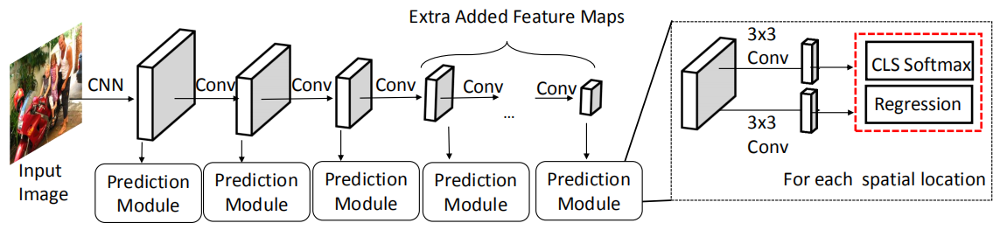
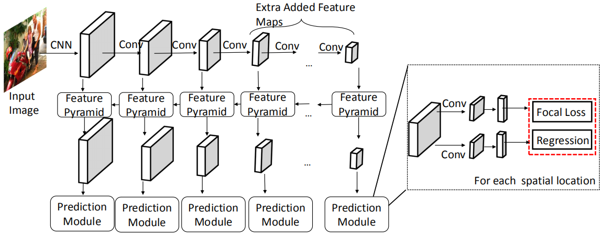
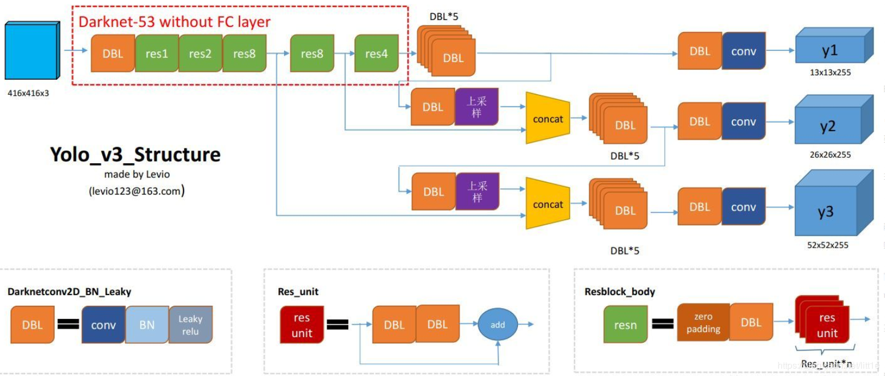
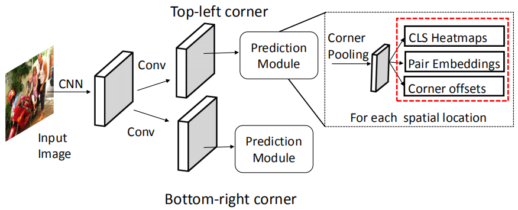

# 1. 目标检测组件-检测方式
> 本系列内容基本来自目标检测综述论文《Recent Advances in Deep Learning for Object Detection》\
> 下载地址：https://arxiv.org/pdf/1908.03673.pdf

（原文叫检测范式，不好理解，改为检测方式）

&emsp;&emsp;当前基于深度学习的目标检测器可以主要分为两大类：
- **两阶段检测器**
- **一阶段检测器**

&emsp;&emsp;对于两阶段检测器，在第一阶段中，将生成一组稀疏的候选区域。在第二阶段，通过深度卷积神经网络对提名的候选区域的特征向量进行编码，然后进行对象类别预测。

&emsp;&emsp;一阶段检测器没有用于提名生成（或学习提名生成）的单独阶段。他们通常将图像上的所有位置都视为潜在对象，并尝试将每个感兴趣的区域分类为背景或目标对象。

&emsp;&emsp;两阶段检测器通常会在许多公共基准数据集上报告最新的结果。但是，它们通常在较低的推理速度方面达不到要求。一阶段检测器要快得多，并且对于实时对象检测应用更为期望，但是与两阶段检测器相比，其准确率上相对较差。

## 1.1. 两阶段检测器
&emsp;&emsp;两阶段的检测器将检测任务分为两个阶段：
- **提名生成**
- **提名区域预测**

&emsp;&emsp;在提名生成阶段，检测器将尝试识别图像中可能是物体的区域。该想法是提出具有较高召回率的区域，使得图像中的所有对象都属于这些提议区域中的至少一个。

&emsp;&emsp;在提名区域预测阶段，基于深度学习的模型用于使用正确的分类标签对这些提名区域进行分类。该区域可以是背景，也可以是预定义类别标签之一中的对象。此外，模型可以优化提名生成器给出的对象位置。

&emsp;&emsp;接下来，我们回顾两阶段检测器中一些最具影响力的工作。

## 1.1.1. R-CNN
&emsp;&emsp;R-CNN是Girshick等人在2014年提出的开创性的两阶段目标检测器。与以前的基于传统检测框架的SegDPM（在Pascal VOC2010上mAP为40.4％）的相比，RCNN显着提高了检测性能，并获得了53.7％的mAP。R-CNN的管道（pipline）可以分为三个部分：
1. 提名生成
2. 特征提取
3. 区域分类

&emsp;&emsp;对于每张图像，R-CNN通过“**选择性搜索**（Selective Search）”生成一组稀疏的提名区域（约2,000个），该方式设计的目的是排除掉可以很容易就识别为背景的区域。然后，将每个提名区域裁剪并调整为固定大小的区域，并通过深度卷积神经网络将其编码为一个（例如4,096维）特征向量，紧接着是一个一对多的SVM进行分类，同时使用提取的特征作为输入来学习包围框回归器，以使最初给的提名区域紧密地包围住目标。如下图：

	

RCNN处理流程

 

&emsp;&emsp;与传统的手工特征描述符相比，深度神经网络生成分层特征并捕获不同层中的不同尺度信息，并最终生成健壮和可区分的特征用来进行分类。利用迁移学习，R-CNN采用ImageNet上预训练的卷积网络权重，将最后一个全连接层（FC层）重新初始化，然后在预训练模型上对整个检测器进行微调，最终完成检测任务。另外，R-CNN在训练前会排除大量的反例，这有助于提高学习速度并减少误报。

&emsp;&emsp;但是，R-CNN面临一些关键缺陷：
- 每个提名区域的特征均由深度卷积网络单独提取（即未共享计算），从而导致大量重复计算。 因此，R-CNN在训练和测试上非常耗时。
- R-CNN的三个步骤（提名生成，特征提取和区域分类）是独立的组件，无法以端到端的方式优化整个检测框架，从而难以获得全局最优解；
- 选择性搜索依赖于低级的视觉信息，因此难以在复杂的情况下生成高质量的提名区域。而且这种方式也无法进行GPU加速。

基本步骤总结：
> 1、候选区域检测：通过2012年提出的selective search方法在图片上提出了约2000个待检测区域；\
> 2、CNN特征提取：通过ImageNet上预训练的卷积神经网络AlexNet (2012)对2000个待检测区域一个一个地提取特征；\
> 3、候选区分类：通过支持向量机(SVM)进行对2000个提取的特征进行分类，得到物体的类别；\
> 4、包围框回归：通过一个bounding box regression调整目标包围框的大小。

### 1.1.2 SPPNet
&emsp;&emsp;He等人受到空间金字塔匹配（SPM）概念的启发，提出了SPPNet来加速R-CNN并学习更多特征。SPPNet使用深度卷积网络从整个图像中计算特征图，并通过空间金字塔池化（SPP）层提取特征图上的固定长度特征向量，而不是单独裁剪提名区域再单独输入CNN模型。SPP将特征图划分为N×N的网格，以获得N的多个值（因此允许以不同的比例获得信息），并对网格的每个单元格执行池化操作，用来提供特征向量。将每个N×N网格获得的特征向量串联起来，用来表示该区域。提取的特征被传送到SVM分类器和边界框回归器中进行预测。与RCNN相比，SPP层还可以在各种比例和高宽比的图像/区域上工作，而无需调整它们的大小。因此，它不会有信息丢失和不必要的几何失真的问题。如下图：

	

SPPNet处理流程

 

与R-CNN相比，SPPNet获得了更好的结果，并且推理速度明显加快。但是，SPPNet的训练仍然是分阶段的，因此无法进行端到端的优化（并且需要额外的缓存来存储提取的功能）。另外，SPP层没有将梯度反向传播到卷积核，因此，SPP层之前的所有参数是被冻结的。这极大地限制了深度骨干网络的学习能力。

### 1.1.3 Fast R-CNN
&emsp;&emsp;Girshick等人提出了 Fast R-CNN，一种多任务学习检测器，解决了SPPNet的这两个局限性。和SPP-Net一样，Fast R-CNN为整个图像计算了一个特征图，并在该特征图上提取了定长区域特征。与 SPPNet 不同的是 Fast R-CNN 使用 ROI Pooling 层提取区域特征。ROI Pooling层是SPP的一种特殊情况，它仅采用一个比例（即，对于N×N网格仅一个N值）将提名区域划分为固定数量的划分，并且还会向卷积核反向传播误差。特征提取后，将特征向量输入到一系列全连接层中，然后进入两个同级输出层：分类层（cls）和回归层（reg）。分类层负责在C+1类（C类加一个背景类）上生成softmax概率，而回归层对4个实值参数进行编码以微调边界框。在Fast RCNN中，特征提取，区域分类和边界框回归等步骤都可以进行端到端优化，而无需额外的缓存空间来存储特征（这与SPP Net不同）。Fast R-CNN的检测精度比R-CNN和SPP-net高得多，并且具有更好的训练和推断速度。

	

Fast R-CNN处理流程

 

基本步骤总结：
> 1、候选区域检测：通过2012年提出的selective search方法在图片上提出了约2000个待检测区域； \
> 2、全图特征提取：对全图进行特征提取；\
> 3、候选区特征提取：使用一个RoI Pooling Layer在全图特征上摘取每一个RoI对应的特征；\
> 4、候选区分类：全连接层(FC Layer)进行分类。\
> 5、包围框回归：全连接层(FC Layer)进行包围框的修正。

### 1.1.4. Faster R-CNN
&emsp;&emsp;尽管在学习检测器方面取得了进步，但是提名生成步骤仍然依赖于传统方法，例如选择性搜索或边缘框等，这些方法基于低级视觉提示，无法以数据驱动的方式进行学习。为了解决这个问题，提出了Faster R-CNN，它依靠一种新颖的提名生成器：Region Proposal Network（RPN）。

&emsp;&emsp;RPN可以通过监督学习方法来学习，它是一个全卷积网络，可以处理任意大小的图像，并在特征图的每个位置上生成一组区域提名。网络使用n×n滑动窗口在特征图上滑动，并为每个位置生成特征向量。然后将特征向量馈入两个同级输出分支中，即对象分类层和边界框回归层。然后将这些结果输入到最终层中，以进行实际的对象分类和边界框定位。RPN插入到Fast R-CNN构建成Faster R-CNN，从而可以对训练数据进行端到端的优化。这样，RPN可以以数据驱动的方式生成提名，并且还可以利用深度骨干网的特征提取能力。

&emsp;&emsp;Faster R-CNN能够在GPU上以5FPS进行预测，并在许多公共基准数据集（例如Pascal VOC 2007、2012和MSCOCO）上取得了最新的结果。当前，有大量基于Faster R-CNN的检测器变体用于不同用途。

	

Faster R-CNN处理流程

 

基本步骤总结：
> 1、全图特征提取：使用共享的卷积层为全图提取特征；
> 2、候选区域检测：将得到的feature maps送入Region Proposal Network (RPN)，RPN生成待检测框(指定RoI的位置)并对RoI的包围框进行第一次修正；\
> 3、候选区特征提取：RoI Pooling Layer根据RPN的输出在feature map上面选取每个RoI对应的特征，并将维度置为定值；\
> 4、候选区分类：全连接层进行分类；\
> 5、包围框回归：全连接层进行包围框的第二次修正。

### 1.1.5. R-FCN
&emsp;&emsp;Faster R-CNN计算输入图像的特征图并且提取特征图上的区域特征，它们在不同区区共享特征提取计算。但是，在区域分类步骤中并没有共享计算操作，每个特征向量仍需要分别经过一系列FC层。这样的额外计算可能会非常大，因为每个图像可能都有数百个提名区域。仅仅删除全连接层将导致检测性能急剧下降，因为深层网络会减少提取区域的空间信息。Dai等人提出了基于区域的全卷积网络（R-FCN），该网络在区域分类步骤中分担了计算成本。R-FCN生成了位置敏感度得分图（Position Sensitive Score Map），该得分图对不同类别的相对位置信息进行了编码，并使用位置敏感ROI池化（PSROI Pooling）通过对目标区域的每个相对位置进行编码来提取空间感知区域特征。所提取的特征向量保留了空间信息，因此与没有区域性全连接层操作的Faster RCNN相比，检测器获得了更好的结果。

	

R-FCN处理流程

 

### 1.1.6 FPN
&emsp;&emsp;Faster R-CNN的另一个问题是它使用单个深层特征图进行最终预测。这使得难以检测不同比例的物体。特别是很难检测到小物体。在DCNN特征表示中，深层特征在语义上强但空间弱，而浅层特征在语义上弱但空间强。Lin等人利用这一特性，提出了将深层特征与浅层特征相结合的**特征金字塔网络（Feature
Pyramid Networks,FPN）** ，从而可以在不同比例的特征图中进行对象检测。主要思想是利用来自较深层的丰富语义信息来增强空间较强的浅层特征。FPN在检测多尺度物体方面取得了重大进展，并且已广泛用于许多其他领域，例如视频检测和人体姿势识别。

## 1.2. 一阶段检测器
&emsp;&emsp;两阶段检测算法将检测流水线分为两部分：区域提名和区域分类； 与两阶段检测算法不同，单阶段检测器没有区域提名的单独阶段。他们通常将图像上的所有位置都视为潜在对象，并尝试将每个感兴趣的区域分类为背景或目标对象，然后直接进行坐标回归。

### 1.2.1. Overfeat
&emsp;&emsp;一个早期的基于深度学习的一阶段目标检测器是Sermanet等人提出的 **Overfeat**。OverFeat通过将DCNN分类器转换为全卷积的目标检测器来执行目标检测。目标检测可以看作是“多区域分类”问题，因此OverFeat通过将最后的FC层视为1x1卷积层来允许任意输入，将分类器扩展到检测器中。分类网络对每个输入区域进行预测输出，标记是否为目标对象。在识别出目标对象后，通过边界框回归器进行回归。

&emsp;&emsp;为了检测多尺度对象，将输入图像调整为多个尺度，然后将其输入网络。最后，将所有尺度的预测合并在一起。与卷积神经网络相比，OverFeat通过使用卷积层共享重叠区域的计算而显示出显着的速度强度，并且只需要通过网络一次传递。但是，分类器和回归器的训练是分开的，没有共同优化。

### 1.2.2. YOLO
&emsp;&emsp;Redmon等人提出了一种称为YOLO的实时检测器。YOLO将目标检测视为回归问题，并将整个图像在空间上划分为固定数量的网格单元（例如使用7×7网格）。每个单元均用来检测一个或多个对象的存在。在最初的实现中，每个单元都被认为包含（最多）两个对象的中心。对于每个单元格，进行的预测包括以下信息：

- 该位置是否有对象
- 边界框坐标和大小（宽度和高度）
- 对象的类别。

	

YOLO处理流程

 

&emsp;&emsp;整个框架是一个单一的网络，它省略了区域提名步骤，可以以端到端的方式进行训练优化。根据精心设计的轻量级架构，YOLO可以以45 FPS进行预测，并通过更简单的主干网达到155 FPS。但是，YOLO面临一些挑战：
- 在给定的位置它最多只能检测到两个物体，这使得难以检测小物体和拥挤的物体。
- 仅使用最后一个特征图进行预测，这不适用于以多个比例和宽高比预测对象。

### 1.2.3. SSD
&emsp;&emsp;2016年，Liu等人提出了另一种一阶段检测器Single-Shot Mulibox Detector（SSD），它解决了YOLO的局限性。

&emsp;&emsp;SSD还将图像划分为网格单元，但是在每个网格单元中，生成了一组具有多个比例和纵横比的**锚点**（Anchor）用来离散化边界框的输出空间（与从YOLO中采用的固定网格单元进行预测不同）。每个锚点都由回归器学习到的4个值偏移量，并由分类器分配了（C个类别+1个背景）个类别概率。

&emsp;&emsp;此外，SSD可以在多个特征图上预测目标，并且每个特征图根据它的感受野来检测特定尺度的目标。为了检测大物体并增加感受野，几个额外的卷积特征图被添加到原始主干网络。

	

SSD处理流程

 

&emsp;&emsp;通过端到端训练方案，在所有预测特征图上使用位置损失和分类损失的加权总和来优化整个网络。通过合并来自不同特征图的所有检测结果来做出最终预测。

&emsp;&emsp;为了避免大量的负样本影响梯度训练，我们使用难例挖掘(hard negative mining)来训练检测器。密集数据增强（Intensive data augmentation）也被用于提高检测精度。 SSD达到了与Faster R-CNN相当的检测精度，但具有进行实时推理的能力。

### 1.2.3. RetinaNet
&emsp;&emsp;如果不通过区域提名过滤掉简单的负样本，那么在一阶段检测器中前景和背景之间的类别不平衡是一个严重的问题。 Lin等人提出了一种一阶段检测器**RetinaNet**，它以更灵活的方式**解决了类不平衡问题**。RetinaNet使用 **焦点损失（focal loss）** 抑制了简单的负样本的梯度，而不是简单地丢弃它们。此外，还使用**特征金字塔网络**来检测不同级别的特征图上的多尺度对象。他们提出的焦点损失（focal loss）大大超过了难例挖掘(hard negative mining)策略。

	

RetinaNet处理流程

 

### 1.2.4. YOLOv2
&emsp;&emsp;Redmon等人提出了一种改进的YOLO版本YOLOv2，该版本显着提高了检测性能，但仍保持了实时推理速度。YOLOv2采用了更强大的深度卷积主干网络，该网络已在ImageNet的高分辨率图像（从224×224到448×448）上进行了预训练，因此所学习的权重对捕获细粒度的信息更加敏感。此外，YOLOv2引入了SSD中的的anchor机制，并且通过从训练数据（而不是手动设置）中进行k均值聚类来定义更好的anchor先验。这有助于减少定位的优化难度。最终，YOLOv2与批归一化层和多尺度训练技术集成在一起，获得了当时最新的检测结果。

### 1.2.5. YOLOv3
&emsp;&emsp;YOLOv3没有太多的创新，主要是借鉴一些好的方案融合到YOLO里面。不过效果还是不错的，在保持速度优势的前提下，提升了预测精度，尤其是加强了对小物体的识别能力。YOLO3主要的改进有：
- 调整了网络结构（Darknet-53）；
- 类别预测方面主要是将原来的单标签分类改进为多标签分类；
- 采用多个scale融合的方式做预测，提升了小目标的检测

	

YOLOv3处理流程

 

### 1.2.5. CornerNet
&emsp;&emsp;先前的方法需要手动设计anchor boxes来训练检测器。后来一系列**anchor-free**目标检测器被提出，通过预测边界框的关键点来代替将对象拟合到anchor。Law和Deng提出了一种anchor-free框架 **CornerNet**，该框架将检测的目标作为一对对角（左上角和右下角）。在特征图的每个位置上，都可以预测**类别热图**(CLS Heatmaps)，**嵌入对**(Pair Embeddings)和**角偏移**(Corner offsets)。类别热图计算出角的可能性，并使用角偏移量来回归角位置。该嵌入对用于将属于同一目标的一对角进行分组。无需依赖手动设计的anchor来匹配对象，CornerNet在MSCOCO数据集上获得了显着改进。后来有基于关键点检测的一阶段检测器的其他几种变体。

	

CornerNet处理流程

 
