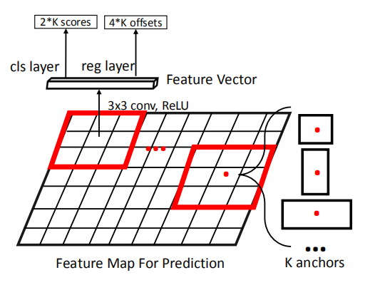

# 1. 目标检测组件-区域提名
> 本系列内容基本来自目标检测综述论文《Recent Advances in Deep Learning for Object Detection》\
> 下载地址：https://arxiv.org/pdf/1908.03673.pdf

&emsp;&emsp;提名生成在目标检测框架中扮演着非常重要的角色。提名生成器生成一组可能是目标的矩形边界框。这些提名区域后续用于分类和定位。我们将提名生成方法分为四类：
- 传统计算机视觉方法
- anchor-based 方法
- Keypoints-based 方法（anchor-free）
- 其他方法

值得注意的是，一阶段检测器和二阶段检测器均有提名生成，主要区别在于二阶段检测器生成仅具有前景或背景信息的稀疏提名集合，而一阶段检测器将图像中的每个区域视为潜在目标区域，并据此估算每个潜在目标的类和边界框坐标。

## 1.1. 传统计算机视觉方法
&emsp;&emsp;这些方法使用传统的计算机视觉方法，基于低级图像特征（例如边缘、角、颜色等）在图像中生成提名。这些技术可以分为三个原则：
- 计算候选框的“对象分数”；
- 合并原始图像中的超像素；
- 生成多个前景和背景片段；

&emsp;&emsp;对象分数（**Objectness Score**）基于预测每个候选框的对象评分的方法，用来衡量其可能包含目标的可能性。Arbelaez等人通过基于视觉提示（例如颜色对比，边缘密度和显着性）的分类，为提名分配了客观性得分。Rahtu等人重新审视了Arbelaez等人的想法，并介绍了一种更有效的级联学习方法来对候选提名的客观评分进行排名。

&emsp;&emsp;超像素合并（**Superpixels Merging**）基于合并分割结果生成的超像素。选择性搜索是一种基于合并超像素的提名生成算法。它计算了通过分割方法生成的多个层次分段，这些分段根据其视觉因素（颜色，区域等）进行了合并，最后将边界框放置在合并的分段上。 Manen等人提出了类似的想法来合并超像素。区别在于学习了合并功能的权重，并且合并过程是随机的。与其他传统方法相比，选择性搜索由于其效率高和召回率高而被广泛用于许多检测框架中。

&emsp;&emsp;种子分割（**Seed Segmentation**）从多个种子区域开始，并且为每个种子生成前景片段和背景片段。为了避免建立分层片段，CPMC生成了一组用不同种子初始化的重叠片段。每个提名片段都是二分类（前景或背景）分割问题。 Enreds和Hoiem结合了选择性搜索和CPMC的思想。它从超像素开始，然后将它们与新设计的特征合并。这些合并的片段用作种子以生成更大的片段，类似于CPMC。但是，生成高质量的分割掩码非常耗时，并且不适用于大规模数据集。

&emsp;&emsp;这些传统计算机视觉方法的主要优点是它们非常简单，并且可以生成具有较高召回率的提名（例如在中等规模的数据集Pascal VOC上）。但是，这些方法主要基于低级视觉特征，例如颜色或边缘。它们无法与整个检测流程一起进行优化。因此，他们无法利用大规模数据集的功能来改善表示学习。在诸如MSCOCO之类的具有挑战性的数据集上，由于这些限制，传统的计算机视觉方法难以生成高质量的提名。

## 1.2. anchor-based 方法
&emsp;&emsp;监督式的提名生成器中的一大家族是基于anchor的方法。它们基于预定义的anchor来生成提名。Ren等人提出区域提名网络（Region Proposal Network，RPN）用来在基于深度卷积特征图中生成提名。网络使用3×3卷积在整个特征图上滑动。对于每个位置，考虑了大小和比例不同的k个anchor（或边界框的初始估计）。这些anchor允许在整个图像中以不同比例匹配目标。基于ground truth 边界框，将目标位置与最合适的anchor进行匹配。从每个anchor提取256维特征向量，并将其传入两个同级分支-分类层和回归层。分类分支将预测每个锚点是一个对象，或者仅仅是背景。回归分支则对四个实数值进行编码，用来回归边界框的位置。如下图：

	

图 RPN示意

 

&emsp;&emsp;后来，SSD通过使用多尺度anchor来匹配对象，在RPN中采用了类似的anchor概念。主要区别在于，SSD为每个anchor提名直接进行分类，而RPN首先评估了anchor提名是前景还是背景，在下一阶段执行分类。

&emsp;&emsp;尽管性能令人满意，但具有多个比例和长宽比的先验anchor是通过启发式方式手动设计的。这些设计选择可能不是最佳的，并且不同的数据集将需要不同的anchor设计策略。为了改善anchor的选择策略，Zhang等人提出了Single Shot Scaleinvariant Face Detector（S3FD），它具有精心设计的anchor用来匹配对象。根据不同特征图的有效感受野，设计了不同的先验anchor。Zhu等人提出了一种anchor设计方法，用于通过放大输入图像尺寸和减小锚跨度来匹配小物体。Xie等人提出了Dimension-Decomposition Region Proposal Network（DeRPN）[90]，该网络基于RPN分解了anchor框的维度。DeRPN使用ancho串机制（ string mechanism）去独立匹配对象的宽和高。这有助于匹配具有较大比例差异的对象，并减少了搜索空间。
（略一些）

## 1.3. Keypoints-based 方法
&emsp;&emsp;另一种提名生成方法是基于关键点检测的，可以将其分为两个系列：
- 基于角的方法（corner-based methods）
- 基于中心的方法（center-based methods）

&emsp;&emsp;**基于角的方法** 通过合并从特征图中学习的一对对角来预测边界框。Denet以概率的方式重新提出了目标检测问题。对于特征图上的每个点，Denet建模了作为4种角类型的对象（左上，右上，右下，左下，右下）之一的分布，并在目标的每个角上应用了朴素贝叶斯分类器估计边界框的置信度得分。这种基于角的算法消除了anchor的设计，成为生成高质量提名的一种更有效的方法。后来基于Denet，Law和Deng提出了CornerNet，它直接对角上的分类信息进行建模。CornerNet利用新颖的特征嵌入方法和角合并层对左上角和右下角的信息进行建模，以正确地匹配属于同一对象的关键点，从而获得公共基准上的SOTA。

&emsp;&emsp;对于**基于中心的方法**，将在特征图的每个位置上预测成为目标中心的概率，并且高度和宽度直接回归而无需任何anchor的先验信息。Zhu等人提出了一种feature-selection-anchor-free（FSAF）框架，可以将其插入具有FPN结构的一阶级检测器中。（略）

## 1.4. 其它方法
&emsp;&emsp;还有其他一些提名生成方法，它们不基于关键点或锚点，但也可以提供有竞争力的性能。 Lu等人提出的AZnet会自动关注高关注区域。AZnet采用了一种搜索策略，将计算资源自适应地定向到可能包含对象的子区域。对于每个区域，AZnet预测两个值：缩放指示器和邻接得分。缩放指示器确定是否进一步划分此区域，该区域可能包含较小的对象，并且表示其客观性的邻接分数。起点是整个图像，然后以这种方式递归处理每个分割的子区域，直到缩放指示符太小为止。与RPN的锚对象匹配方法相比，AZnet在匹配稀疏对象和小型对象方面表现更好。
