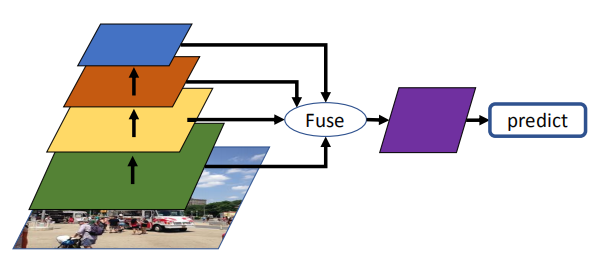
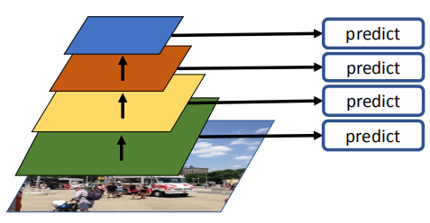
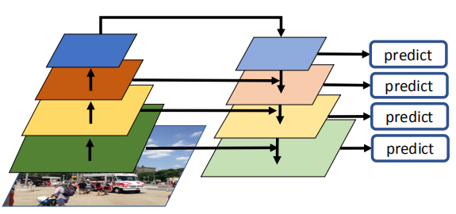
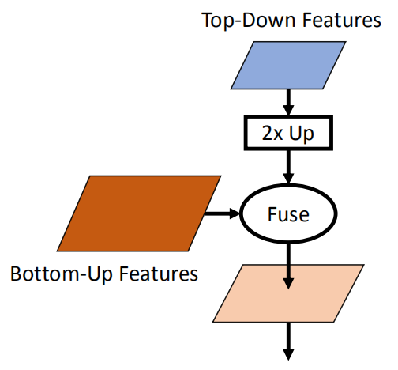

# 1. 目标检测组件-特征表示学习
> 本系列内容基本来自目标检测综述论文《Recent Advances in Deep Learning for Object Detection》\
> 下载地址：https://arxiv.org/pdf/1908.03673.pdf

&emsp;&emsp;特征表示学习是整个检测框架中的关键组成部分。目标对象位于复杂的环境中，并且在尺度和长宽比方面差异很大。得到一个具有良好鲁棒性以及可区分性的特征能够使检测获得很好的性能。 在本节中，我们介绍用于对象检测的特征表示学习策略。具体来说，我们确定了四类：
- 多尺度特征学习（multi-scale feature learning）
- 区域特征编码（Region Feature Encoding）
- 上下文推理（contextual reasoning）
- 形变特征学习（deformable feature learning）

## 1.1. 多尺度特征学习（multi-scale feature learning）
&emsp;&emsp;基于深度卷积网络的典型目标检测算法（例如Fast R-CNN和Faster RCNN）仅使用单个图层的特征图来检测目标。但是，在单个特征图上检测多个尺度和宽高比的目标非常具有挑战性。深度卷积网络中不同层学习了不同的信息。具体来说：
- 具有丰富空间信息的浅层特征具有更高的分辨率和较小的感受野，因此更适合于检测小物体；
- 深层中的语义丰富的特征对光照、平移更加健壮，并且具有较大的感受野，并且更适合于检测大物体。

这会导致当检测小物体时，需要高分辨率的表示，这些物体的表示甚至可能在深层特征中不可用，从而使小物体检测变得困难。

&emsp;&emsp;一些技术比如扩张/空洞卷积（dilated/atrous convolutions）被提出来避免下采样（downsampling），甚至在更深的层中也使用了高分辨率信息。同时，在没有足够大的感受野的情况下，在浅层中检测大型物体也是不理想的。因此，处理特征尺度问题已经成为目标检测中的基础研究问题。有4种解决多尺度特征学习问题的方式：图像金字塔（Image Pyramid）、预测金字塔（Prediction Pyramid）、集成特征（Integrated Features）、特征金字塔（Feature Pyramid）。

### 1.1.1. 图像金字塔（Image Pyramid）
&emsp;&emsp;一个直观的想法是将输入图像调整为多个不同的尺度（图像金字塔）并训练多个检测器，每个检测器负责一定范围的尺度。在测试过程中，将图像调整为不同的大小，然后再使用多个检测器，并合并检测结果。这在计算上可能是昂贵的。如下图：

	

图 图像金字塔（Image Pyramid）

 

### 1.1.2 集成特征（Integrated Features）
&emsp;&emsp;另一种方法是通过组合多层特征构建单一特征图，并通过新构建的特征图进行预测。通过融合空间丰富的浅层特征和语义丰富的深层特征，新构造的特征包含了丰富的信息，可以检测出不同尺度的目标。这些组合通常通过使用跳连（skip connections）来实现。由于不同层次的特征具有很高的方差，因此需要进行特征归一化。如下图：

	

图 集成特征（Integrated Features）

 

### 1.1.3 预测金字塔（Prediction Pyramid）
&emsp;&emsp;Liu等人提出的SSD将来自多个层的特征结合在一起。在SSD中，预测是从多个层进行的，其中每个层负责一定数量的对象。后来，许多研究遵循这一原理来检测多尺度物体。如下图：

	

图 预测金字塔（Prediction Pyramid）

 

### 1.1.4 特征金字塔（Feature Pyramid）
&emsp;&emsp;结合集成特征和预测金字塔的优势，Lin等人提出的特征金字塔网络（Feature Pyramid Network，FPN），该模型以自顶向下的方式将不同比例尺特征与横向连接集成在一起，以构建一组比例尺不变特征图，并在这些特征金字塔上学习了多个尺度相关的分类器。具体来说，使用深层语义丰富的功能来增强浅层空间丰富的功能。这些自上而下和侧向的特征通过逐元素求和或串联来组合，使用小卷积减小维度。如下图：

	

图 特征金字塔（Feature Pyramid）

 

&emsp;&emsp;FPN在目标检测以及其他应用程序方面显示出显着改进，并且在学习多尺度特征方面取得了最新技术成果。后来开发了FPN的许多变体，并对特征金字塔块进行了修改，如下图特征合并通用框架：

	

图 特征合并通用框架

 

图中自上而下的特征被2倍向上采样，并与自下而上的特征融合。fuse方法可以是逐元素求和、乘法、串联等。卷积和归一化层可以插入到此通用框架中，以增强语义信息并降低内存消耗。

## 1.2. 区域特征编码（Region Feature Encoding）
&emsp;&emsp;对于两阶段检测器，**区域特征编码**是将提名中的特征提取到固定长度特征向量中的关键步骤。

&emsp;&emsp;在R-CNN中，对整个图像中裁剪提名区域，并通过双线性插值将裁剪区域的大小调整为固定大小的块（224×224），然后用深度卷积特征提取器进行特征提取。 这个方法对高分辨率区域特征进行了编码，计算量很大。\
&emsp;&emsp;后来Girshick和Ren等人提出了 ROI Pooling 层来编码区域特征。ROI Pooling将每个区域划分为n×n个单元（默认情况下为7×7个单元），只有前向阶段中信号最大的神经元才会前进。这类似于最大池化（Max Pooling），但跨（可能）不同大小的区域。 ROI Pooling从下采样的特征图中提取的特征，因此难以处理小对象。\
&emsp;&emsp;Dai提出了ROI Warping Layer，它通过双线性插值对区域特征进行编码。\
&emsp;&emsp;由于DCNN中的下采样操作，原始图像和下采样的特征贴图中的对象位置可能会错位，而RoI Pooling和RoI Warping层无法处理。何恺明等人没有像ROI Warping和ROI Pooling那样量化网格边界，提出了ROI Align层，该层通过在每个网格内的部分采样位置处的双线性插值解决了量化问题。\
&emsp;&emsp;Jiang等人基于ROI Align提出了Precise ROI Pooing（PrROI Pooling），它避免了坐标的任何量化，并且在边界框坐标上具有连续的梯度。

&emsp;&emsp;为了增强降采样区域特征的空间信息，Dai等人提出了Position Sensitive ROI Pooing (PSROI Pooling) ，它保留了下采样特征的相对空间信息。根据其相对空间位置，生成的区域特征图的每个通道仅对应于输入区域的子通道。\
&emsp;&emsp;基于PSROI，Zhai等人提出了特征选择网络，它通过利用子区域和长宽比之间的差异来学习具有鲁棒性的区域特征。所提出的网络编码的子区域和长宽比信息被轻量头选择性地池化并提炼初始区域特征。

&emsp;&emsp;后来，更多算法从不同角度更好地编码区域特征被提出。\
&emsp;&emsp;Zhu等人提出的CoupleNet通过合并ROI Pooling Layer和PSROI Pooling Layer的输出来提取区域特征。ROI Pooling Layer提取了全局区域信息，但是在遮挡较高的对象方面却性能不佳，而PSROI Pooling Layer则更多地关注位置信息。CoupleNet通过逐元素求和，增强了从ROI Pooling和PSROI Pooling生成的特征，并生成了更强大的特征。 \
&emsp;&emsp;Dai等人提出了Deformable ROI Pooling，该方法通过学习每个网格的偏移量并将其添加到网格中心来概括对齐的RoI Pooling。子网格从常规ROI Pooling Layer开始以提取初始区域特征，然后将所提取的特征用于辅助网络的回归偏移。 Deformable ROI Pooling可自动对图像内容建模，而不受固定的感受野约束。

## 1.3. 上下文推理（contextual reasoning）
&emsp;&emsp;上下文信息在对象检测中起着重要作用。目标通常倾向于出现在特定的环境中，有时也与其他目标共存。对于每个实例，鸟类通常都会在天空中飞翔。有效地使用上下文信息可以帮助提高检测性能，尤其是对于检测信息不足的目标（小目标，遮挡物等）。了解目标与其周围上下文之间的关系可以提高检测者对场景的理解能力。对于传统的目标检测算法，已经进行了许多探索上下文的工作，但是对于基于深度学习的目标检测，尚未广泛地探索上下文。这是因为卷积网络已经隐式地从分层特征表示中捕获了上下文信息。但是，最近的一些努力仍然尝试利用上下文信息。一些著作甚至表明，在某些情况下，上下文信息甚至可能损害检测性能。在本节中，我们将从两个方面回顾目标检测的上下文推理：全局上下文（global context）和区域上下文（region context）。

### 1.3.1. 全局上下文（global context）
&emsp;&emsp;全局上下文推理是指从整个图像中的上下文中学习。与直接将图像中的特定区域进行分类的传统检测器不同，此处的想法是使用上下文信息（即来自图像其余部分的信息）对特定的特定区域进行分类。例如，对于传统的检测器而言，从图像中检测棒球球可能是一个挑战（因为它可能与其他运动的球相混淆）；但是如果使用了图像其余部分的上下文信息（例如棒球场，球员，球棒），则识别棒球对象变得更加容易。

&emsp;&emsp;一些代表性的工作包括ION、DeepId和Faster R-CNN的改进版本。（省略一些人的工作）

### 1.3.2. 区域上下文（region context）
&emsp;&emsp;区域上下文推理对周围区域的上下文信息进行编码，并学习对象与其周围区域之间的交互。用上下文直接建模不同位置和类别的对象关系是非常具有挑战性的。 （省略一些人的工作）

## 1.4. 形变特征学习（deformable feature learning）
&emsp;&emsp;一个好的检测器应该对物体的非刚性形变（nonrigid deformation）具有鲁棒性。在深度学习时代之前，可变形的组件模型（Deformable Part based Models，DPM）已成功用于对象检测。DPM使用可变形编码方法通过多个组成部分来表示对象，从而使检测器对非刚性对象转换具有鲁棒性。为了使基于深度学习的检测器能够对对象部件的变形进行建模，许多研究人员已经提出了检测框架，以对目标部件进行显式建模。DeepIDNet提出了可感知变形的池化层，以对不同目标类别之间的变形信息进行编码。Dell和Zhu等人设计了可变形卷积层，可自动学习辅助位置偏移量，用来增强在特征图的常规采样位置上采样的信息。
