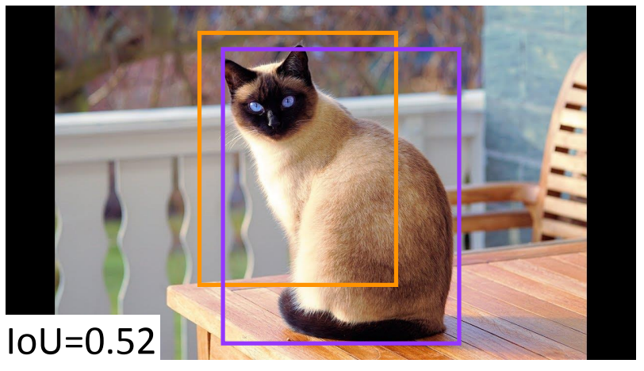

# 1. 目标检测学习策略-训练策略
> 本系列内容基本来自目标检测综述论文《Recent Advances in Deep Learning for Object Detection》\
> 下载地址：https://arxiv.org/pdf/1908.03673.pdf

&emsp;&emsp;与图像分类相反，目标检测需要优化定位和分类任务，这使得训练稳健的检测器更加困难。另外，还需要解决一些问题，例如不平衡采样、定位、速度等。因此，有必要开发创新的学习策略来训练高效的检测器。接下来，我们回顾了一些对象检测的学习策略。

&emsp;&emsp;这一节我们将首先讨论训练目标检测器的学习策略，主要包括：数据增强（data augmentation）、不均衡采样（imbalance sampling）、级联学习（ cascade learning）、定位精细化（localization refinement）以及其它学习策略。

## 1.1. 数据增强（data augmentation）
&emsp;&emsp;数据增强对于几乎所有的深度学习方法都很重要，因为它们经常需要数据，并且更多的训练数据可以带来更好的结果。在目标检测中，为了增加具有多种视觉特性的训练数据，在训练Faster R-CNN中使用了图像的水平翻转。 在一阶段检测器中使用了更多的数据增强策略，包括旋转（rotation）、随机裁剪(random crops)、扩展(expanding)和色彩抖动（color jittering，亮度、饱和度、对比度等）。这种数据增强策略已显示出显着提高检测准确性。

## 1.2. 不均衡采样（imbalance sampling）
&emsp;&emsp;在目标检测中，负样本和正样本的不平衡是一个关键问题。也就是说，提名的大多数感兴趣区域实际上只是背景图像。它们中很少有是真实的实例（或目标）。这导致训练检测器时有数据不平衡的问题。具体而言，出现了两个问题，需要解决：**类别不均衡**和**难度不均衡**（有些样本很难识别对）。类别不平衡的问题是大多数候选区都属于背景，而只有少数区域包含对象。这导致背景提名在训练期间主导了梯度。难度不平衡与第一个问题密切相关，在第一个问题中，由于类别不平衡，可以轻松地对大多数背景提名进行分类，而对目标进行分类则变得更加困难。已经有各种策略来解决类别不平衡问题。

&emsp;&emsp;R-CNN和Fast R-CNN等两阶段检测器将首先排除大多数负样本，并保留2000个提名以进行进一步分类。在Fast R-CNN中，从这2000个提名中随机抽取了负样本，每个小批量中的正负样本比例固定为1：3，进一步减少类别不平衡的不利影响。随机样本可以解决类别不平衡的问题，但不能完全利用负样本提名中的信息。一些负样本提名可能包含有关图像的丰富上下文信息，而一些困难提名（hard proposals）可能有助于提高检测准确性。为了解决这个问题，Liu等人提出了困难负样本抽样策略（hard negative sampling strategy），该方法固定了前景和背景比率，但抽样了困难样本提名来更新模型。特别是，选择了分类损失较高的负样本提名进行训练。

&emsp;&emsp;为了解决难度不平衡，大多数采样策略都是基于精心设计的损失函数。对于目标检测，在C + 1个类别（C个目标类别加一个背景类别）上学习了一个多分类器。假设该区域被标记为类别为u的ground truth，并且p是C+1个类别（ $p = \{p_0，\ldots, p_C\}$ ）上的输出离散概率分布。损失函数由下式给出：

$$L_{cls}(p, u) = −\log p_u$$

&emsp;&emsp;Lin 提出了**焦点损失（focal loss）**。它不是丢弃所有简单样本，而是抑制简单样本的信号，这种方法给每个样本赋予了几个重要的权重 $w$、$r$、$t$:

$$ L_{FL} = −α(1 − p_u)^γ \log (p_u) $$

其中 $α$ 和 $γ$ 是控制重要权重的参数。简单样本的梯度信号被抑制，使得训练过程更加注重困难样本提名。

&emsp;&emsp;Li等人采用了焦点损失中类似的思想，提出了一种新颖的**梯度协调机制（gradient harmonizing mechanism，GHM）**。GHM不仅抑制了简单的提名，而且避免了异常值的负面影响。

&emsp;&emsp;Shrivastava等人提出了一种**在线困难样本挖掘策略（online hard example mining strategy ）**，该策略基于与SSD类似的原理，可以自动选择困难样本进行训练。 与SSD不同，在线困难样本挖掘仅考虑难度信息，而忽略类别信息，这意味着在每个微型批处理中前景和背景之比不是固定的。他们认为，在对象检测任务中，困难样本比类不平衡更重要。

## 1.3. 定位精细化（localization refinement）
&emsp;&emsp;目标检测器必须为每个目标提供一个紧密的定位预测（bbox或mask）。精确的定位是一项挑战，因为预测通常集中在目标最具辨别力的部分，而不一定是包含目标的区域。

&emsp;&emsp;在一些情况下，要求检测算法进行高质量的预测（高IoU阈值），如下图所示，说明在高IoU阈值状态下检测器可能如何失败。

	

图 高IoU检测失败

 

图中是高IoU阈值检测失败情况的示例。紫色框是真实框，黄色框是预测框。 在IoU需求较低的情况下，此预测是正确的，而在IoU阈值较高的情况下，由于与对象的重叠不足，因此是误报。

&emsp;&emsp;定位改进的一般方法是生成高质量的提名。在本节中，我们将回顾一些其他的定位精细化方法。在R-CNN框架中，使用L-2边框回归函数来精细化定位，在Fast R-CNN中，通过端到端的训练方案学习平滑的L1回归函数，如下所示：

$$ L_{reg}(t^c , v) = \displaystyle \sum_{i∈\{x,y,w,h\}} SmoothL1(t^c_i − v_i) $$
$$ SmoothL1(x) =  {\begin{cases} {0.5x^2} &{if |x| < 1} \\\ {|x| − 0.5} &{otherwise}  \end{cases} } $$

其中：
- 对每个目标类别，偏移位置为 $t^c = (t^c_x , t^c_y , t^c_w, t^c_h)$ ;
- $v$是每个目标的边框( $v = (v_x, v_y, v_w, v_h)$ )
- $x$ , $y$ , $w$ , $h$ 分别是边框的中心的坐标、宽、高.

&emsp;&emsp;其它方法：LocNet、MultiPath Network、 FitnessNMS、 Grid R-CNN。

## 1.4. 级联学习（ cascade learning）
&emsp;&emsp;级联学习是一种从粗到精的学习策略，它从给定分类器的输出中收集信息，以级联的方式构建更强大的分类器。

&emsp;&emsp;级联学习策略是Viola和Jones首次用来训练具备鲁棒性的面部检测器。在他们的模型中，轻巧的检测器首先排除大多数容易产生的负样本提名，并提出困难提名来训练下一阶段的检测器。对于基于深度学习的目标检测算法，Yang等人提出了CRAFT（(Cascade Region-proposal-network And FasT-rcnn) ，它通过级联学习策略学习了RPN和区域分类器。 CRAFTS首先学习了标准的RPN，然后学习了两类Fast RCNN，它排除了大多数简单负样本。其余样本用于构建由两个由Fast RCNN组成的级联区域分类器。

&emsp;&emsp;其它相关网络：RefineDet、Cascade R-CNN。

## 1.5. 其它学习策略
&emsp;&emsp;还有其他一些学习策略可以提供有趣的方向，但尚未进行广泛的探索。 这些方法可分为以下几类：adversarial learning、training from scratch 和 knowledge distillation。
