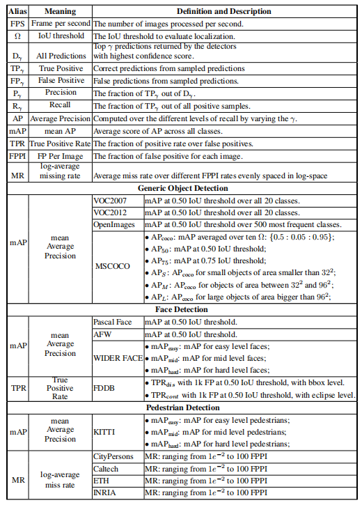

# 1. 目标检测基准-通用目标检测基准
> 本系列内容基本来自目标检测综述论文《Recent Advances in Deep Learning for Object Detection》\
> 下载地址：https://arxiv.org/pdf/1908.03673.pdf

## 1.1. 评估数据集
**Pascal VOC2007** 是一个用于目标检测的中型数据集，它有20种类别。 VOC2007中数据分为三个部分：2501张训练图片、2510张验证图片和5011张测试图片。

**Pascal VOC2012** 是一个用于目标检测的中型数据集，与Pascal VOC2007有相同的20个类别。 VOC2012中数据分为三个部分：5717张训练图片、5823张验证图片和10991张测试图片。 VOC2012测试集的注释信息（annotation information）不可用。

**MSCOCO** 是包含80个类别的大规模数据集。 MSCOCO中数据分为三个部分：分别使用118287张训练图片、5000张测试图片和40670张验证图像。MSCOCO测试集的注释信息不可用。

**OpenImage** 包含600个类别的，它由190万张图像1500万个对象的组成的数据集。500个最常见的类别用于评估检测基准，其中70％以上的类别有超过1000个训练样本。

**LVIS** 是一个新收集的基准，包含164000张图像和1000个以上类别。

**ImageNet** 也是具有200个类别的重要数据集。但是，ImageNet的规模巨大，并且对象范围的范围类似于VOC数据集，因此它并不是检测算法的常用基准。

## 1.2. 评估指标（Evaluation Metrics）
&emsp;&emsp;下表中显示了评估指标的详细信息，检测准确性和推断速度均用于评估检测算法。对于检测准确率，将mean Average Precision（mAP）用作所有这些挑战的评估指标。对于VOC2012，VOC2007和ImageNet，mAP的IoU阈值设置为0.5；对于MSCOCO，将应用更全面的评估指标。这里有六个评估分数，展示了检测算法的不同功能，包括在不同IoU阈值和不同尺度目标上的性能。

	

图 性能评估表

 
