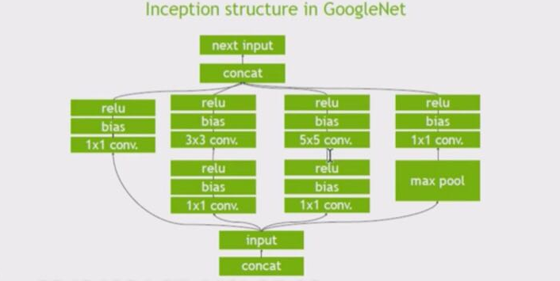
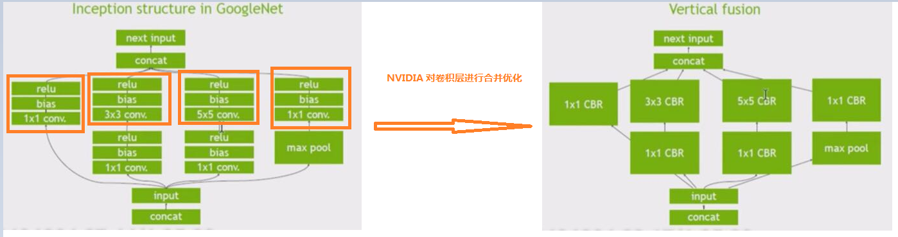
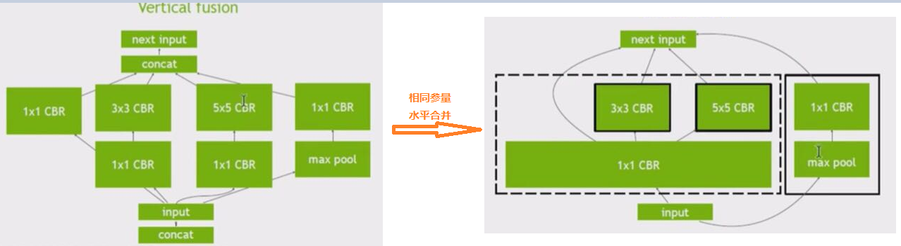
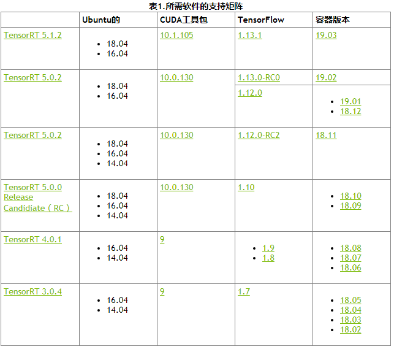
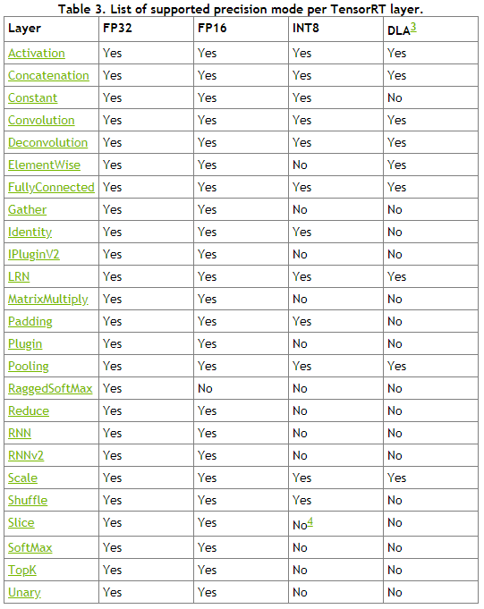
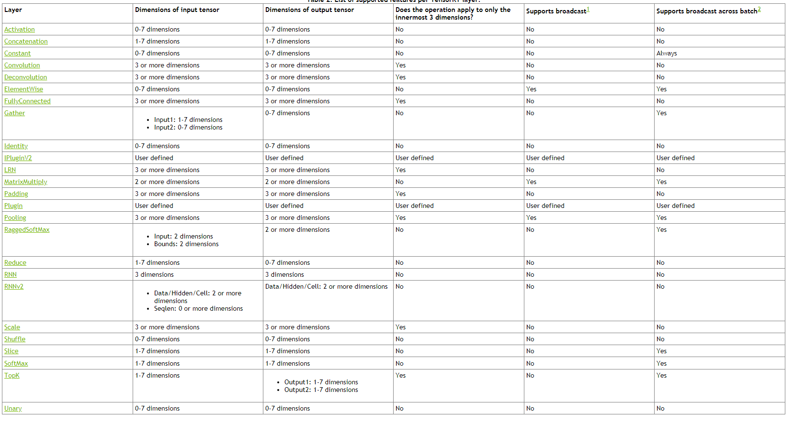
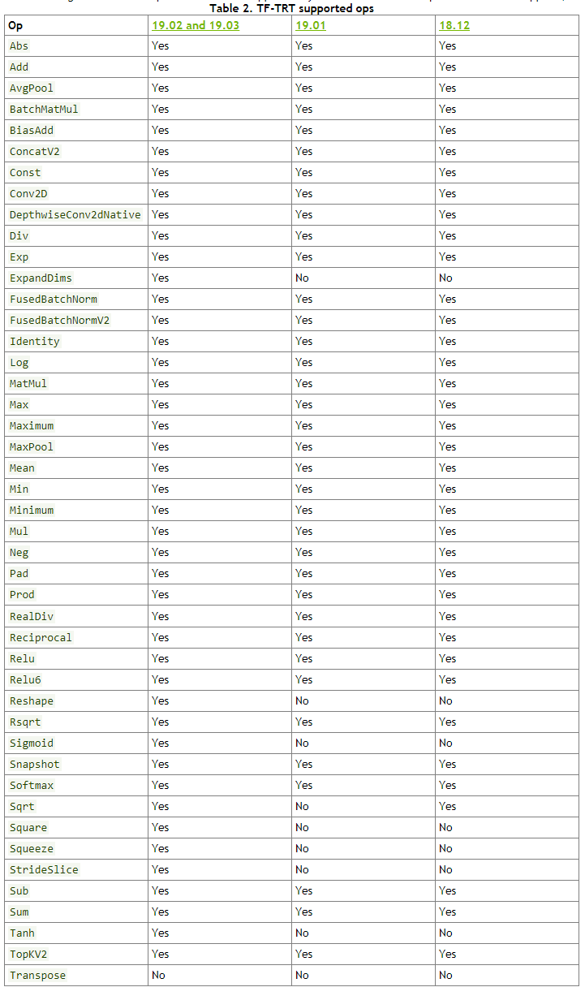

# 1.TF-TRT简介
##摘要
>本指南提供了有关如何使用TensorRT（TF-TRT）加速TensorFlow推理的说明。
##1.集成概述

TensorFlow™ 与TensorRT™ （TF-TRT）的集成优化并执行兼容的子图，允许TensorFlow执行剩余的图形。虽然您仍然可以使用TensorFlow的广泛且灵活的功能集，但 TensorRT将解析模型并尽可能将优化应用于图形的各个部分。

您需要从训练有素的TensorFlow模型中创建SavedModel（或冻结图形）（请参阅[构建并加载SavedModel](https://www.tensorflow.org/guide/saved_model#build_and_load_a_savedmodel)），并将其提供给TF-TRT的Python API（请参阅使用[TF-TRT](https://docs.nvidia.com/deeplearning/dgx/tf-trt-user-guide/index.html#usingtftrt)），然后：
- 返回TensorRT优化的SavedModel（或冻结图）。
- 用TensorRT优化节点替换每个支持的子图（称为 **TRTEngineOp**），生成一个新的TensorFlow图。

在TF-TRT优化期间，TensorRT对神经网络图执行几项重要的转换和优化。首先，消除具有未使用输出的层以避免不必要的计算。接下来，在可能的情况下，将卷积，偏置和ReLU层融合以形成单个层。另一种转换是水平层融合或层聚合，以及聚合层到它们各自输出的所需划分。水平层融合通过组合采用相同源张量的层并使用相似的参数应用相同的操作来提高性能。
**注意**：这些图优化不会更改图中的基础计算; 相反，他们希望重新构建图表以更快，更有效地执行操作。
TF-TRT是TensorFlow二进制文件的一部分，这意味着安装时 tensorflow-GPU，你也可以使用TF-TRT。
**注意**：这仅适用于使用TensorFlow Python API而非C ++ API的情况。

>意思是说TensorFlow 集成了TensorRT ，然后TensorRT有什么好处呢？
>- 1、冻结过程中对不需要的变量和旁边的乱七八糟的没有用到的东西进行去除
>- 2、冻结过程中对某些层进行合并，这些层是特定的，比如cnn层，具体支持哪些层下面会说。合并后效率更高
>- 3、对图层进行水平融合，说白了，就是上面的融合是纵向的，现在是横向的。我们用下列图表示说明下。

**原始图**

**纵向合并**

**横向合并**

###1.1集成接口介绍
可用于优化TensorFlow冻结图的Python TF-TRT API 是create_inference_graph。此函数有许多参数来配置优化。
```
def create_inference_graph(input_graph_def,
                           outputs,
                           max_batch_size=1,
                           max_workspace_size_bytes=2 << 20,
                           precision_mode="fp32",
                           minimum_segment_size=3,
                           is_dynamic_op=False,
                           maximum_cached_engines=1,
                           cached_engine_batches=[]
                           use_calibration=True,
                           rewriter_config=None,
                           input_saved_model_dir=None,
                           input_saved_model_tags=None,
                           output_saved_model_dir=None,
                           session_config=None):
  """Python wrapper for the TRT transformation.

```
**参数**：
**inputgraphdef**
这个参数是 GraphDef 包含要转换的模型的对象。
**输出**
此参数列出图中的输出节点。未标记为的张量 输出 被认为是可由建造者优化的瞬态值。
**max_batch_size**
此参数是指定TensorRT将优化的批次大小的最大批量大小。在运行时，可以选择较小的批量大小。在运行时，不支持更大的批处理大小。
**max_workspace_size_bytes**
TensorRT操作员通常需要临时工作空间。此参数限制网络中任何层可以使用的最大大小。如果提供的划痕不足，则TensorRT可能无法找到给定层的实现。
**precision_mode**
TF-TRT仅支持在FP32中训练的模型，换句话说，模型的所有权重都应以FP32精度存储。话虽这么说，TensorRT可以在优化过程中将张量和权重转换为较低的精度。该 precision_mode参数设置精度模式; 可以是其中之一 FP32， FP16， 要么 INT8。低于FP32的精度，即FP16和INT8，将改善推理的性能。如果可能，FP16模式使用[Tensor内核或半精度硬件指令](https://www.nvidia.com/en-us/data-center/tensorcore/)。INT8精度模式使用[整数硬件指令](https://www.nvidia.com/en-us/data-center/volta-gpu-architecture/)。
**minimum_segment_size**
此参数确定TensorRT引擎中TensorFlow节点的最小数量，这意味着节点数少于此数量的TensorFlow子图将不会转换为TensorRT。因此，通常较小的数字如5是优选的。这也可用于更改优化的INT8引擎中的最小节点数，以更改最终优化图以微调结果准确性。
**is_dynamic_op**
如果此参数设置为 真正，转换和构建TensorRT引擎将在运行时发生，如果图中的张量具有未知的初始形状或动态形状，则这是必要的。
注意：运行时转换会增加延迟。因此，如果模型太小，转换不会阻止推断，那么您可能只会这样做。
**maximum_cached_engines**
动态TensorRT操作中缓存的TensorRT引擎的最大数量。
**cached_engine_batches**
批量大小用于预创建缓存引擎。
**cached_engine_batches**
批量大小用于预创建缓存引擎。
**use_calibration**
如果，则忽略此参数 precision_mode 不是INT8。
- 如果设置为 真正，将创建校准图以校准缺失的范围。必须使用校准图转换为推理图`calib_graph_to_infer_graph（）` 运行校准后。
- 如果设置为 假对于图中的每个张量，将预期量化节点（不包括将被融合的量子节点）。如果缺少范围，则会发生错误。
注意：如果TensorRT量化的张量与使用伪量化训练的张量之间存在不匹配，则精度可能会受到负面影响。
rewriter_config
一个 RewriterConfig proto追加了 TensorRTOptimizer至。如果没有，它将创建一个默认设置。
input_saved_model_dir
要加载的目录 `SavedModel`包含要转换的输入图。仅在使用时使用input_graph_def 是 没有。
**input_saved_model_tags**
用于标识的标记列表 `MetaGraphDef` 的 `SavedModel` 载入。
**output_saved_model_dir**
如果不 没有，构建一个 SavedModel 使用返回的 `GraphDef`并将其保存到指定的目录。此选项仅在从a加载输入图形时有效`SavedModel`换句话说，何时 `input_saved_model_dir` 是指定和`input_graph_def` 是 没有。
**session_config**
该 `ConfigProto` 用来创建一个 会议。如果未指定，则为默认值ConfigProto 将会被使用。
- 返回：
> 新 GraphDef 同 TRTEngineOps 放在图中替换子图。

- 异常：

>ValueError异常：如果提供的精度模式无效。
RuntimeError：如果返回的状态消息格式错误。


## 2、环境支持
TF-TRT是TensorFlow二进制文件的一部分，这意味着安装时 `tensorflow-GPU`，你也可以使用TF-TRT。有两种方法可以安装TF-TRT：
- 1.你拉一个TensorFlow容器，例如18.10，你将拥有TF-TRT所需的所有软件依赖性，因此，你不需要在容器内安装任何东西。
`注意：下面的一些脚本 NVIDIA-例子 目录需要其他依赖项，例如Python 要求包。参考自述 有关这些附加依赖项的安装说明的文件。`
- 2.要么：
按照[这些说明](https://www.tensorflow.org/install/install_linux#nvidia_requirements_to_run_tensorflow_with_gpu_support)从源代码中使用TensorRT集成编译TensorFlow。

### 2.1支持版本对应列表


### 2.2支持的图层对应列表

### 2.3每个图层能达到的精度

## 3、使用TF—TRT
### 3.1支持的操作

### 3.2SavedModel的TF-TRT

如果你有 SavedModel 表示您的TensorFlow模型，您可以直接从您的TensorRT模型中创建TensorRT推理图 SavedModel， 例如：
```python
# Import TensorFlow and TensorRT
import tensorflow as tf
import tensorflow.contrib.tensorrt as trt
# Inference with TF-TRT `SavedModel` workflow:
graph = tf.Graph()
with graph.as_default():
    with tf.Session() as sess:
        # Create a TensorRT inference graph from a SavedModel:
        trt_graph = trt.create_inference_graph(
            input_graph_def=None,
            outputs=None,
            input_saved_model_dir=”/path/to/your/saved/model”,
            input_saved_model_tags=[”your_saved_model_tags”],
            max_batch_size=your_batch_size,
            max_workspace_size_bytes=max_GPU_mem_size_for_TRT,
            precision_mode=”your_precision_mode”)
        # Import the TensorRT graph into a new graph and run:
        output_node = tf.import_graph_def(
            trt_graph,
            return_elements=[“your_outputs”])
       sess.run(output_node)
```
除此之外 max_batch_size， max_workspace_size_bytes 和 precision_mode，您需要提供以下参数 create_inference_graph：
**input_saved_model_dir**
你的路径 `SavedModel` 目录。
**input_saved_model_tags**
用于标识的标记列表 MetaGraphDef 的 SavedModel 载入。
在哪里：
**[“your_outputs”]**
图表中最终结果节点的名称字符串列表。

3.3冻结图的TF-TRT
如果您有TensorFlow模型的冻结图，则首先需要加载冻结的图形文件并解析它以创建反序列化 GraphDef。然后你可以使用 GraphDef 创建TensorRT推理图，例如：
```python
# Import TensorFlow and TensorRT
import tensorflow as tf
import tensorflow.contrib.tensorrt as trt
# Inference with TF-TRT frozen graph workflow:
graph = tf.Graph()
with graph.as_default():
    with tf.Session() as sess:
        # First deserialize your frozen graph:
        with tf.gfile.GFile(“/path/to/your/frozen/graph.pb”, ‘rb’) as f:
            graph_def = tf.GraphDef()
            graph_def.ParseFromString(f.read())
        # Now you can create a TensorRT inference graph from your
        # frozen graph:
        trt_graph = trt.create_inference_graph(
            input_graph_def=graph_def,
            outputs=[“your_output_node_names”],
            max_batch_size=your_batch_size,
            max_workspace_size_bytes=max_GPU_mem_size_for_TRT,
            precision_mode=”your_precision_mode”)
        # Import the TensorRT graph into a new graph and run:
        output_node = tf.import_graph_def(
            trt_graph,
            return_elements=[“your_outputs”])
        sess.run(output_node)

```
在哪里，再次补充 max_batch_size， max_workspace_size_bytes，和 precision_mode，你需要提供以下参数 create_inference_graph：
输出
图表中最终结果节点的名称字符串列表。
在哪里：
**“/path/to/your/frozen/graph.pb”**
模型的冻结图的路径。
**[“your_outputs”]**
图表中最终结果节点的名称字符串列表。与...一样 输出 以上。

### 3.4MetaGraph和checkpoint的TF-TRT

如果你没有 SavedModel 或者TensorFlow模型的冻结图形表示，但是有单独的 元图 和检查点文件，你首先需要使用这些来创建一个冻结图，然后输入 create_inference_graph 功能，例如：
```python
# Import TensorFlow and TensorRT
import tensorflow as tf
import tensorflow.contrib.tensorrt as trt
# Inference with TF-TRT `MetaGraph` and checkpoint files workflow:
graph = tf.Graph()
with graph.as_default():
    with tf.Session() as sess:
        # First create a `Saver` object (for saving and rebuilding a
        # model) and import your `MetaGraphDef` protocol buffer into it:
        saver = tf.train.import_meta_graph(“/path/to/your/model.ckpt.meta”)
        # Then restore your training data from checkpoint files:
        saver.restore(sess, “/path/to/your/model.ckpt”)
        # Finally, freeze the graph:
               your_outputs = [“your_output_node_names”]
        frozen_graph = tf.graph_util.convert_variables_to_constants(
            sess,
            tf.get_default_graph().as_graph_def(),
            output_node_names=[“your_outputs”])
        # Now you can create a TensorRT inference graph from your
        # frozen graph:
        trt_graph = trt.create_inference_graph(
            input_graph_def=frozen_graph,
            outputs=[“your_outputs”],
            max_batch_size=your_batch_size,
            max_workspace_size_bytes=max_GPU_mem_size_for_TRT,
            precision_mode=”your_precision_mode”)
        # Import the TensorRT graph into a new graph and run:
        output_node = tf.import_graph_def(
            trt_graph,
            return_elements=[“your_outputs”])
        sess.run(output_node)
```

在哪里，再次补充 `max_batch_size，` `max_workspace_size_bytes` 和 `precision_mode`，你需要提供以下参数 `create_inference_graph`：
输出
图表中最终结果节点的名称字符串列表。
在哪里：
**“/path/to/your/model.ckpt.meta”**
模型的MetaGraphDef协议缓冲区的路径。这通常是在培训期间创建和保存的。
**“/path/to/your/model.ckpt”**
训练期间保存的最新检查点文件的路径。
[“your_outputs”]
图表中最终结果节点的名称字符串列表。与...一样 输出 以上。
