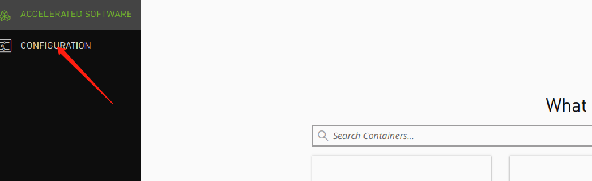
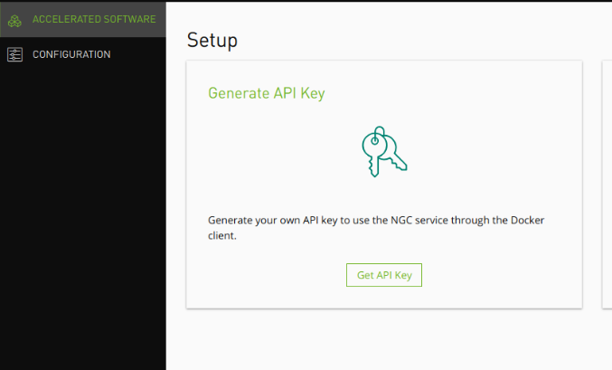
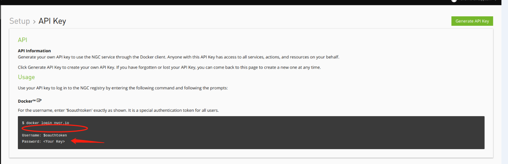

# nvidia加速推理环境搭建
## 1.docker安装
删除旧版本
```python
sudo apt-get remove docker docker-engine docker.io containerd runc
```

更新源
```python
sudo apt-get update
```

安装包的下载链接
```python
sudo apt-get install \
    apt-transport-https \
    ca-certificates \
    curl \
    gnupg-agent \
    software-properties-common
```

设置gpg key
```python
curl -fsSL https://download.docker.com/linux/ubuntu/gpg | sudo apt-key add -
```

增加 repository
```python
sudo add-apt-repository \
   "deb [arch=amd64] https://download.docker.com/linux/ubuntu \
   $(lsb_release -cs) \
   stable"
```

开始安装docker
```python
sudo apt-get update
sudo apt-get install docker-ce docker-ce-cli containerd.io
sudo apt-cache madison docker-ce

  docker-ce | 5:18.09.1~3-0~ubuntu-xenial | https://download.docker.com/linux/ubuntu  xenial/stable amd64 Packages
  docker-ce | 5:18.09.0~3-0~ubuntu-xenial | https://download.docker.com/linux/ubuntu  xenial/stable amd64 Packages
  docker-ce | 18.06.1~ce~3-0~ubuntu       | https://download.docker.com/linux/ubuntu  xenial/stable amd64 Packages
  docker-ce | 18.06.0~ce~3-0~ubuntu       | https://download.docker.com/linux/ubuntu  xenial/stable amd64 Packages

```

选定一个版本进行安装
```python
sudo apt-get install docker-ce=<VERSION_STRING> docker-ce-cli=<VERSION_STRING> containerd.io
```


测试是否安装成功
```python
sudo docker run hello-world
```


## 2.安装nvidia-docker
```python
＃如果你安装了nvidia-docker 1.0：我们需要删除它和所有现有的GPU容器
docker volume ls -q -f driver = nvidia-docker | xargs -r -I {} -n1 docker ps -q -a -f volume = {} | xargs -r docker rm -f
sudo apt-get purge -y nvidia-docker

＃添加软件包存储库
curl -s -L https://nvidia.github.io/nvidia-docker/gpgkey | \
  sudo apt-key add  -
distribution = $（ 。/ etc / os-release ; echo $ ID $ VERSION_ID ）
curl -s -L https://nvidia.github.io/nvidia-docker/ $ distribution /nvidia-docker.list | \
  sudo tee /etc/apt/sources.list.d/nvidia-docker.list
sudo apt-get update

＃安装nvidia-docker2并重新加载Docker守护程序配置
sudo apt-get install -y nvidia-docker2
sudo pkill -SIGHUP dockerd

＃测试nvidia-smi与最新官方CUDA图像
docker run --runtime = nvidia --rm nvidia / cuda：9.0-base nvidia-smi
```


## 3.添加docker加速源
在docker pull的时候很慢，容易被被reset，我们添加网易的源
```python
$ sudo echo "DOCKER_OPTS=\"\$DOCKER_OPTS --registry-mirror=http://hub-mirror.c.163.com\"" >> /etc/default/docker
$ service docker restart
```


## 4.添加nvidia登陆用户并下载nvidia的容器
在 https://ngc.nvidia.com/org?from=/catalog/landing  登陆自己的账号




点击get api key  就可以获取到  docker 登录的秘钥了。


添加好后就可以下载。
```python
docker pull nvcr.io/nvidia/tensorflow:19.04-py3
```


使用下面命令进入环境
```python
sudo nvidia-docker run -it --rm --shm-size=1g --ulimit memlock=-1 --ulimit stack=67108864 -v /home/ubuntu:/home/ -v /data:/workspace/ nvcr.io/nvidia/tensorflow:19.04-py3
```
