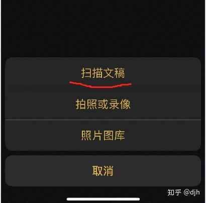
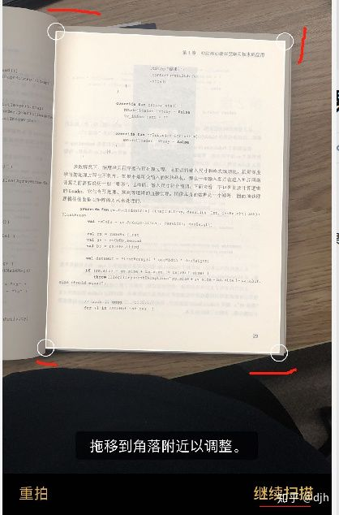

# 做一个简易的文档检测
## 一、简述
一直很喜欢苹果手机的文档扫描功能如下:






run
所以想自己弄一个，具体细节如下。

## 二、AI模型训练
AI模型的训练借用RRanddom大神的代码。

https://github.com/RRanddom/tf_doc_localisation
​
### 2.1 Requirements
```
tensorflow version==1.12.0
PIL (pip install PIL)
download part of the dataset，extract it to $MIDV_DATASET
Edit tf_doc_localisation/receipt_dataset.py line 18
midv_dir = MIDV_DATASET ## for example: /data/your_download_directory/midv_500
```

### 2.2 how to train the network
```
cd tf_doc_localisation
mkdir data
python synthesis_data.py
python receipt_dataset.py
python train.py
```
### 2.3 输出pb模型方便后面MNN推理

```
import tensorflow as tf
import numpy as np 

outputNodeNames = ["heats_map_regression/pred_keypoints/BiasAdd"]
input_checkpoint = "data/train_dir/model.ckpt-15462"
graph_def_file = "frozen_model.pb"
input_name = "input"

with tf.Session(graph=tf.Graph()) as sess:
    inputImg = tf.placeholder(dtype=tf.float32, shape=(1, 800, 600, 3), name=input_name)
    saver = tf.train.import_meta_graph(input_checkpoint + '.meta', input_map={'sub:0':  inputImg}, clear_devices=True)
    saver.restore(sess, input_checkpoint)
    graph = tf.get_default_graph() # 获得默认的图
    graph_def = graph.as_graph_def()
    # tf.import_graph_def(graph_def, input_map={"IteratorGetNext:0": inputImg})
    # print(tf.get_default_graph().as_graph_def() == graph_def)
    # outputNodes = outputNodeNames.split(",")
    output_graph_def = tf.graph_util.convert_variables_to_constants(sess, graph_def, outputNodeNames)

    # Finally we serialize and dump the output graph to the filesystem
    with tf.gfile.GFile(graph_def_file, "wb") as f:
        f.write(output_graph_def.SerializeToString())
```
## 三、MNN推理
### 3.1MNN编译

https://github.com/alibaba/MNN
​
使用阿里的MNN：

### 3.1.1编译转换工具
```
git clone https://github.com/alibaba/MNN.git
cd /path/to/MNN
./schema/generate.sh
./tools/script/get_model.sh # 可选，模型仅demo工程需要

mkdir build && cd build && cmake .. -DMNN_BUILD_CONVERTER=true && make -j8
```

### 3.1.2pb转mnn

./MNNConvert-fTF--modelFile frozen_model.pb--MNNModel frozen_model.mnn--bizCodebiz
将frozen_model.mm push 到sdcard。


### 3.1.3编译出android 要使用的so

1. 在https://developer.android.com/ndk/downloads/下载安装NDK，建议使用最新稳定版本
   在 .bashrc 或者 .bash_profile 中设置 NDK 环境变量，例如：export ANDROID_NDK=/Users/username/path/to/android-ndk-r14b
   cd /path/to/MNN
2. ./schema/generate.sh
3. ./tools/script/get_model.sh（可选，模型仅demo工程需要）。注意get_model.sh需要事先编译好模型转换工具，参见这里。
cd project/android
4. 编译armv7动态库：mkdir build_32 && cd build_32 && ../build_32.sh
5. 编译armv8动态库：mkdir build_64 && cd build_64 && ../build_64.sh 
将编译出的so，放到android lib目录下
```
libMNN.so
libMNN_CL.so
libMNN_Express.so
libMNN_Vulkan.so
```
## 四、android代码书写
我喜欢用c++书写，所以直接将代码引入到jni，

```
public static native long nativeDocInit(String modelName);
public static native long nativeDocDetection(byte[] bufferData,int srcW, int srcH, int srcC,int dstW, int dstH,int dstC,int[] outx, int[] outy,int degrees);
public static native long nativeDocRelease();
```

jni代码
```
    jint *outxp = env->GetIntArrayElements(outx, 0);
    jint *outyp = env->GetIntArrayElements(outy, 0);
    jbyte *bufferData = env->GetByteArrayElements(jbufferData, NULL);


    MNN::CV::Matrix trans;
    trans.setScale(1.0 / (srcW - 1), 1.0 / ( srcH - 1));
    trans.postRotate(degrees, 0.5, 0.5);
//    trans.postScale(-1.0,1.0, 0.5, 0.0);
    trans.postScale((dstW - 1), (dstH - 1));
    trans.invert(&trans);

    process->setMatrix(trans);

    process->convert((const unsigned char *)bufferData, srcW, srcH, 0, nhwc_Tensor);

    inputTensor->copyFromHostTensor(nhwc_Tensor);

    interpreter->runSession(session);

    outTensor->copyToHostTensor(tensorOutHost);
    auto output  = tensorOutHost->host<float>();

    auto output_h = 25;
    auto output_w = 19;
    auto output_dim = 4;
    float heatmaps[output_w*output_h*output_dim];

    ::memcpy(heatmaps, output, output_h * output_w * output_dim * sizeof(float));

    dsnt(output_h, output_w, heatmaps, outxp, outyp);

    env->ReleaseIntArrayElements(outx,outxp,0);
    env->ReleaseIntArrayElements(outy,outyp,0);
    env->ReleaseByteArrayElements(jbufferData,bufferData, 0);
```
## 结尾
至此，部署的主要步骤已完毕。运行速度还是可以的。给自己star
参考
https://github.com/djh123/doc_Detection
